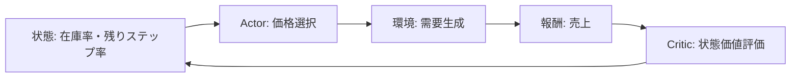
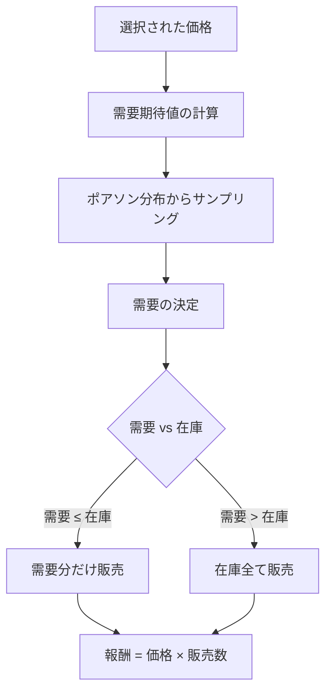

# このフォルダのプログラムについて

このフォルダのプログラムは、在庫に対して最適な価格を付けるタスクを題材として、環境およびActor-Criticモデルを勉強も兼ねてスクラッチで組んでみたものになります。<br>


# 動的価格設定の強化学習プログラム

Actor-Criticアルゴリズムによる在庫管理と価格最適化

## プログラム概要

- 目的: 在庫を期限内に売り切るための最適な価格設定を学習
- 手法: Actor-Critic強化学習アルゴリズム
- 環境: 在庫数と残りステップ数を考慮した価格決定環境



---

## 環境設定

**パラメータ**
- 最大在庫数: 100
- 最大ステップ数: 31
- 価格選択肢: [100, 120, 140, 160, 180]

**状態表現**
```python
状態 = [残り在庫の割合, 残りステップの割合]
```

2次元の連続値で環境の状態を表現

---

## PriceEnvironment クラス

**需要モデル**
```python
需要期待値 = (最高価格 / 選択価格) × (在庫 × 0.05)
実際の需要 = Poisson(需要期待値)
```

- 価格が低いほど需要期待値が高くなる
- ポアソン分布により確率的な需要を生成

**報酬計算**
```python
売上在庫 = min(在庫, max(需要, 0))
報酬 = 価格 × 売上在庫
```

---

## 需要生成の仕組み



---

## ニューラルネットワーク構造

**Actor ネットワーク**
```
入力層(2) → 隠れ層(64, ReLU) → 出力層(5, Softmax)
```
- 状態から行動確率分布を出力
- 5つの価格選択肢に対する確率を生成

**Critic ネットワーク**
```
入力層(2) → 隠れ層(64, ReLU) → 出力層(1)
```
- 状態の価値を推定
- スカラー値を出力

---

## Actor-Critic アルゴリズム

```mermaid
graph TB
    A[状態 St] --> B[Actor: 行動確率 πθ]
    A --> C[Critic: 状態価値 V St]
    B --> D[行動選択 At]
    D --> E[環境との相互作用]
    E --> F[報酬 Rt, 次状態 St+1]
    F --> G[Critic: 状態価値 V St+1]
    G --> H[TD誤差 δ = Rt + γV St+1 - V St]
    H --> I[Critic更新: MSE損失]
    H --> J[Actor更新: -log πθ At|St × δ]
```

---

## 学習ループの流れ

1. 環境リセット: 初期状態を取得
2. 行動選択: Actorから行動確率を取得し、確率的に価格を選択
3. 環境ステップ: 選択した価格で需要を生成し、報酬を取得
4. TD誤差計算: `δ = R + γV(S_{t+1}) - V(S_t)`
5. Critic更新: MSE損失で状態価値を学習
6. Actor更新: `-log(π(A|S)) × δ` で方策を改善
7. 終了判定: 在庫ゼロまたは最大ステップ到達で終了

---

## 損失関数

**Critic の損失**
```python
target_value = reward + γ × V(next_state)
loss_critic = MSE(V(state), target_value)
```
- 時間差学習(TD学習)による状態価値の更新

**Actor の損失**
```python
δ = target_value - V(state)
loss_actor = -log(π(action|state)) × δ
```
- 方策勾配法によるアドバンテージベースの更新

---

## 学習設定

**ハイパーパラメータ**
- エピソード数: 2500
- 割引率 (γ): 0.98
- 学習率: 0.001 (Actor/Critic共通)
- 最適化手法: Adam

**学習プロセス**
- 各エピソードで在庫を売り切るまで価格決定を繰り返す
- 総報酬(総売上)を記録し、学習の進捗を可視化

---

## 出力結果

**学習曲線の可視化**
```python
plt.plot(range(len(total_reward_list)), total_reward_list)
```

- 横軸: エピソード番号
- 縦軸: エピソードごとの総報酬(総売上)
- 学習の進行に伴う報酬の変化を確認

---

## プログラムの特徴

1. 動的価格設定: 在庫状況と残り時間に応じた価格戦略
2. 確率的需要: ポアソン分布による現実的な需要モデル
3. オンライン学習: 各ステップごとにネットワークを更新
4. Actor-Critic: 方策と価値関数を同時に学習
5. 連続的な意思決定: エピソード内で複数回の価格決定を実行
