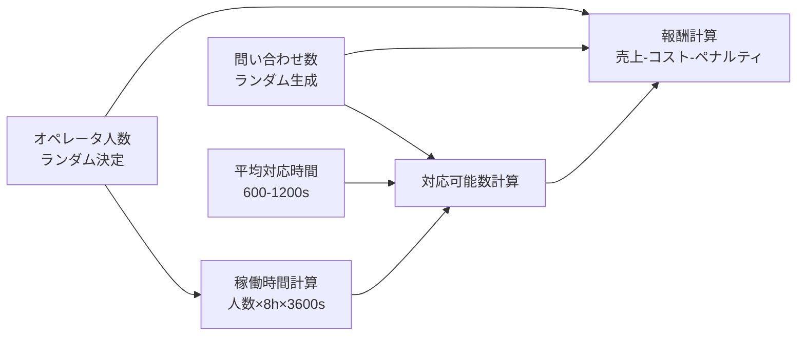
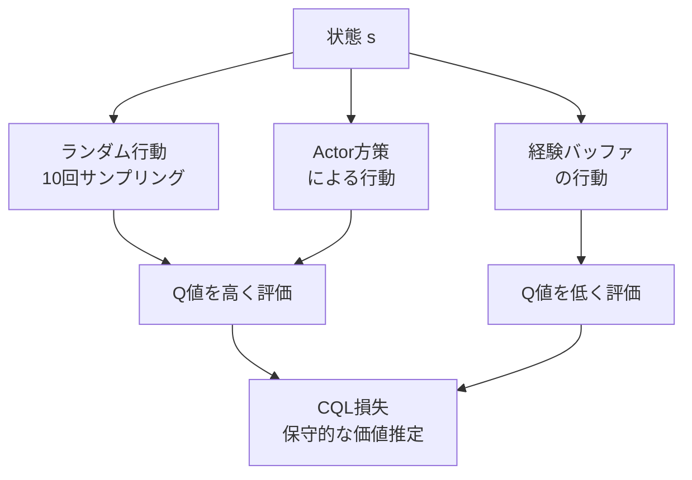
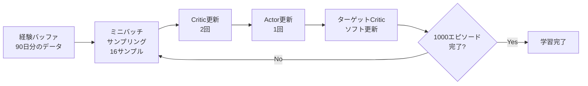
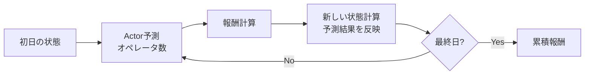
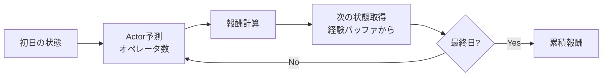

# このフォルダのプログラムについて

このフォルダのプログラムは、コンタクトセンターのパーコール受託契約で最適なオペレータ人数を探るタスクを題材として、環境およびCQL-SACモデルを勉強も兼ねてスクラッチで組んでみたものになります。<br>


# プログラム概要

Conservative Q-Learning (CQL) を用いたオペレータ配置最適化

---

## 問題設定

**環境パラメータ**
- 期間: 90日間のサンプルデータ
- 稼働時間: 1日8時間
- オペレータ人数: 14〜18人の範囲で調整
- 収益構造:
  - 対応した問い合わせ: 1件あたり1,200円
  - オペレータコスト: 1人1日あたり24,000円
  - 未対応ペナルティ: 1件あたり1,500円

---

## データ生成プロセス



状態: (正規化問い合わせ数, 対応率, 稼働率)
行動: オペレータ増減人数
報酬: 売上 - コスト - ペナルティ

---

## ニューラルネットワーク構造

**Actor (方策ネットワーク)**
```
入力: 状態 (3次元)
  ↓
全結合層 (64ユニット) + ReLU
  ↓
分岐: μ (平均) と log σ (対数標準偏差)
  ↓
正規分布からサンプリング + tanh → 行動 (-1〜1)
```

**Critic (価値ネットワーク)**
```
入力: 状態 (3次元) + 行動 (1次元)
  ↓
全結合層 (64ユニット) + ReLU
  ↓
全結合層 (1ユニット) → Q値
```

**Double Critic**: 2つのCriticを並列に使用し、過大評価を防止

---

## SAC (Soft Actor-Critic) の損失関数

**Actor の損失**
```
L_π = E[−Q(s,a) + α·log π(a|s)]
```
- Q(s,a): Criticが予測した行動価値
- log π(a|s): 方策のエントロピー (探索性を維持)
- α = 2: エントロピーの重み

**Critic の損失 (SAC部分)**
```
L_SAC = E[(Q(s,a) − target_Q)²]
target_Q = r + γ(Q'(s',a') − α·log π(a'|s'))
```
- γ = 0.99: 割引率
- Q': ターゲットCritic (τ = 0.005 でソフト更新)

---

## CQL (Conservative Q-Learning) の正則化

**CQL損失項**
```
L_CQL = α_CQL · (E[Q(s, a_random)] + E[Q(s, a_policy)] − E[Q(s, a_data)])
```



目的: 経験バッファにない行動のQ値を抑制し、過大評価を防ぐ

---

## 学習プロセス



**更新頻度**:
- 1エピソードあたり3回の更新サイクル
- Criticを2回更新後、Actorを1回更新

---

## 評価方法

**オンポリシー評価**


**オフポリシー評価**


---

## 主要な実装ポイント

**1. Reparameterization Trick**
```python
epsilon = torch.randn_like(sigma)
sampling = mu + sigma * epsilon
action = torch.tanh(sampling)
```
勾配を方策パラメータに伝播可能にする

**2. ヤコビアン補正**
```python
log_prob = sampling_log_prob - torch.log(1 - action.pow(2) + 1e-6)
```
tanh変換後の確率密度を正しく計算

**3. ターゲットネットワークのソフト更新**
```python
param = τ · source_param + (1 - τ) · target_param
```
学習の安定化

---

## 結果の可視化

プログラムは以下の3つの報酬推移をプロットします:

1. On-policy predicted: Actorの予測を反映した状態遷移での報酬
2. Off-policy predicted: 経験バッファの状態遷移での報酬
3. Valid: 元データの実際の報酬

これにより、学習したActorの性能を多角的に評価できます。

---

## まとめ

**実装内容**
- アルゴリズム: SAC + CQL
- 目的: オペレータ人数の最適化による利益最大化
- 特徴: オフライン強化学習により、過去データから安全な方策を学習

**主要コンポーネント**
- Actor: 連続行動空間での方策学習
- Double Critic: 価値の過大評価を抑制
- CQL正則化: 未経験行動への保守的な評価
- Replay Buffer: 90日分の経験データ
