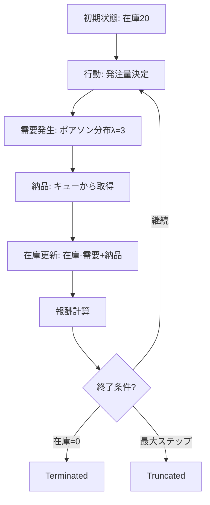
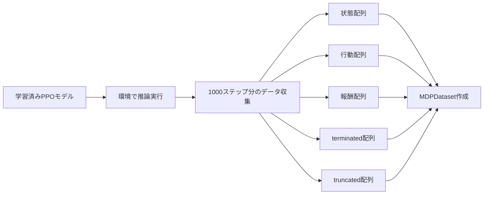
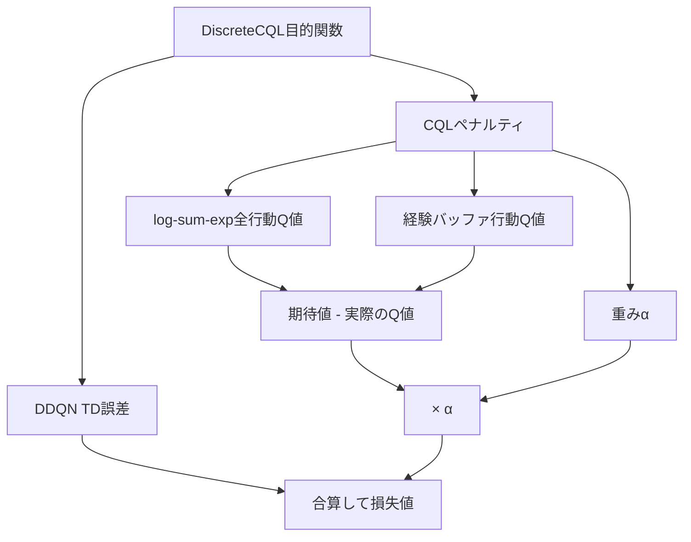
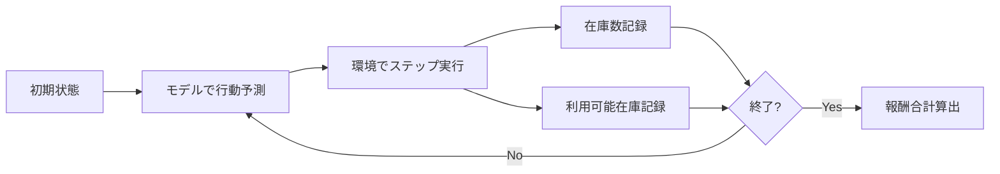
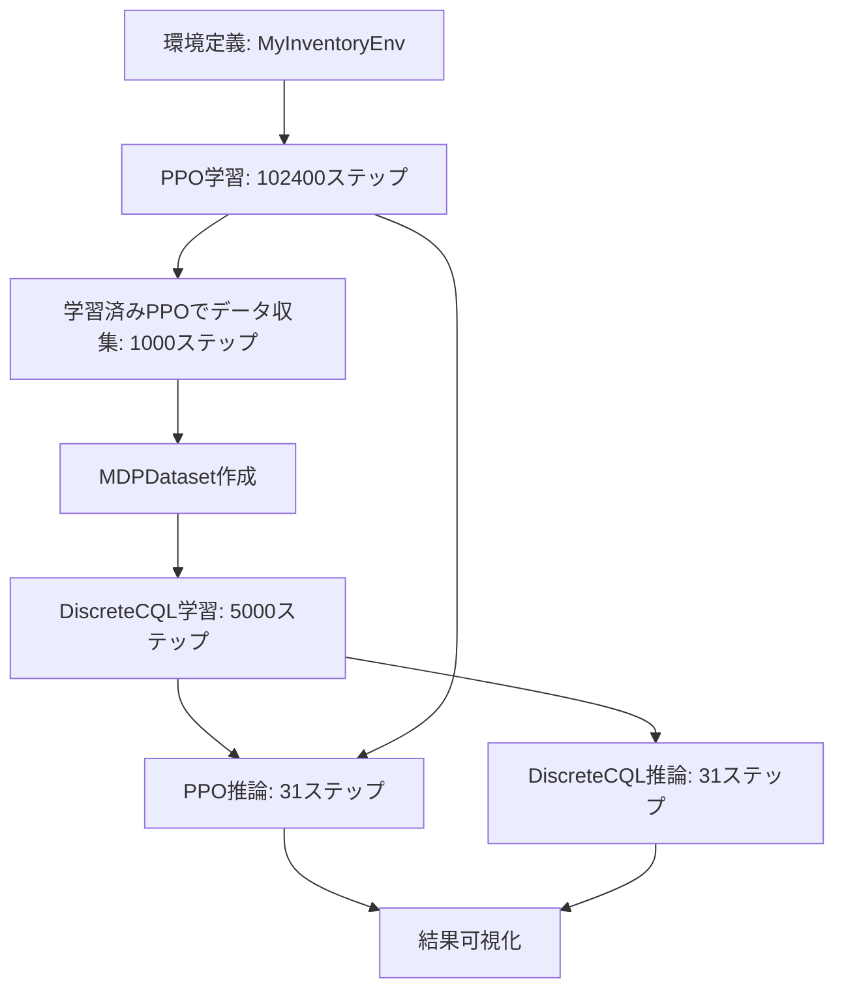

# このフォルダのプログラムについて

このフォルダのプログラムは、在庫に対しての最適量の発注を題材として、or-gymを用いて環境を組みつつ、d3rlpyライブラリーを用いてDiscreteCQL(CQL-DDQN)を試してみたものになります。<br>また、比較としてstable-baseline3ライブラリーでのPPOを用いました。<br>


## プログラム概要

1. カスタム在庫管理環境の構築
2. PPOによるオンライン学習
3. PPOで収集したデータを用いたオフライン学習(DiscreteCQL)
4. 両モデルの推論結果の比較

---

## カスタム環境: MyInventoryEnv

**環境パラメータ**
- 状態空間: 在庫数 + 納品待ち数(リードタイム分)
- 行動空間: 発注量(0〜10)
  - 連続値または離散値
- リードタイム: 発注から納品までの期間
- 最大ステップ数: 1エピソードの長さ

---

## 環境の動作フロー



---

## 報酬設計

**報酬関数**
```python
delta = abs(在庫数 - 15)  # 目標在庫数は15

if 0 < delta < 5:
    reward = 1.0
elif 5 <= delta < 10:
    reward = 0
else:
    reward = -(delta × 0.1)

# 発注コスト
if 発注量 != 0:
    reward -= 0.5
```

**終了条件**
- Terminated: 在庫数が0になった場合
- Truncated: 最大ステップ数に到達

---

## PPO学習フェーズ

**モデル設定**
- アルゴリズム: Proximal Policy Optimization
- 行動空間: 離散(0〜10)
- 学習パラメータ:
  - learning_rate: 0.001
  - n_steps: 2048
  - batch_size: 64
  - n_epochs: 10
  - gamma: 0.98
  - gae_lambda: 0.95
  - clip_range: 0.2

**学習ステップ数**
- total_timesteps: 102,400

---

## データ収集フェーズ

**collect_data_by_trained_actor関数**



**収集データ**
- timestep: 1000ステップ
- 用途: DiscreteCQLのオフライン学習用

---

## DiscreteCQL学習フェーズ

**アルゴリズム概要**
- ベース: Double DQN (DDQN)
- 拡張: CQLペナルティの追加

**CQLペナルティ**
```
CQLペナルティ = (全行動のQ値の期待値 - 経験バッファの行動のQ値) × α
```

**モデル設定**
- batch_size: 32
- gamma: 0.99
- learning_rate: 0.0003
- n_critics: 2
- target_update_interval: 100
- alpha: 1.0 (CQLペナルティの重み)

---

## DiscreteCQLの目的関数



**学習ステップ**
- n_steps: 5000
- n_steps_per_epoch: 1000

---

## 推論フェーズ

**inference_timestep関数**
両モデルで31ステップの推論を実行



**記録データ**
- inventory_list: 在庫数の推移
- available_inventory_list: 在庫数+納品待ち数の推移

---

## 結果の可視化

**プロット内容**
4つの系列を同時表示:
1. (CQL-DDQN) inventory: DiscreteCQLの在庫数
2. (CQL-DDQN) available_inventory: DiscreteCQLの利用可能在庫
3. (PPO) inventory: PPOの在庫数
4. (PPO) available_inventory: PPOの利用可能在庫

---

## 処理フロー全体図



---

## まとめ

**実装した処理**
1. 環境構築: リードタイム付き在庫管理環境
2. オンライン学習: PPOで環境から直接学習
3. データ収集: 学習済みPPOで経験データ生成
4. オフライン学習: DiscreteCQLで収集データから学習
5. 比較評価: 両モデルの推論結果を可視化
