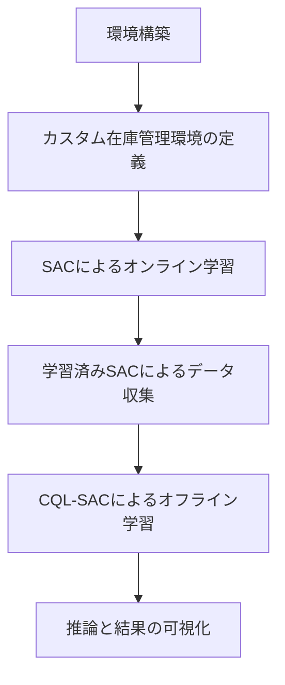
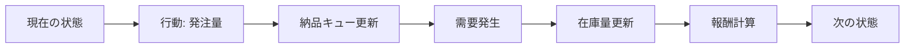
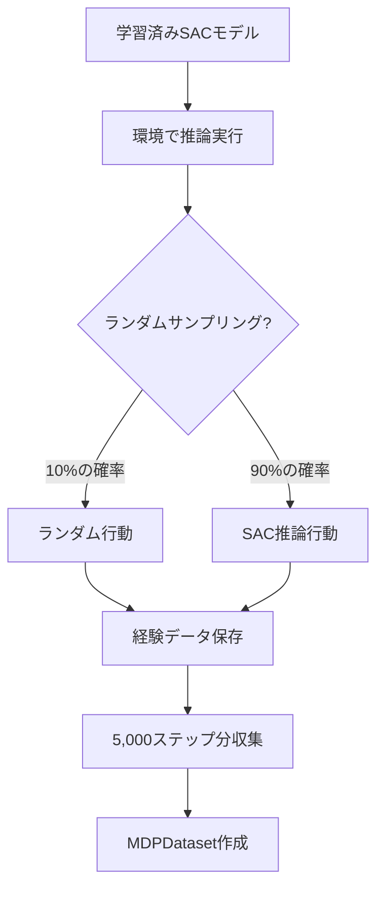

# このフォルダのプログラムについて

このフォルダのプログラムは、在庫に対しての最適量の発注を題材として、or-gymを用いて環境を組みつつ、d3rlpyライブラリーを用いてCQL-SACを試してみたものになります。<br>また、比較としてstable-baseline3ライブラリーでのSACを用いました。<br>


## プログラムの全体構成



---

## 1. カスタム在庫管理環境 (MyInventoryEnv)

**環境の特徴**
- 状態空間: 在庫数 + 納品待ち数（リードタイム分）
- 行動空間: 発注量（0～10）
  - 連続値または離散値で選択可能
- リードタイム: 発注から納品までの遅延期間
- 需要: ポアソン分布（期待値=3）からサンプリング

---

## 2. 環境の動作フロー



**報酬設計**
- 目標在庫数: 15
- 在庫数15からの差分に応じて報酬を設定
  - 差分0～5: +1.0
  - 差分5～10: 0
  - 差分10以上: -0.1 × 差分
- 発注時: -0.5（発注コスト）
- 在庫切れ: エピソード終了

---

## 3. SAC (Soft Actor-Critic) によるオンライン学習

**学習設定**
- アルゴリズム: SAC（連続行動空間）
- 学習ステップ数: 102,400
- バッファサイズ: 2,048
- バッチサイズ: 64
- 割引率 (gamma): 0.98

**目的**
環境との相互作用を通じて、在庫管理方策を学習

---

## 4. データ収集フロー



**収集データ**
- 状態、行動、報酬、終了フラグ、打ち切りフラグ
- 合計5,000ステップ分のデータ

---

## 5. CQL-SAC (Conservative Q-Learning) によるオフライン学習

**CQLの特徴**
オフラインデータのみから学習する強化学習手法

**損失関数の構成**

Actor損失:
```
-(行動の価値 + 重み × エントロピー)
```

Critic損失:
```
SAC損失 + CQL損失
```

- SAC損失: `(ターゲットQ - Q)²`
- CQL損失: `重み × (ランダム行動価値 + Actor推論行動価値 - 経験バッファ行動価値)`

---

## 6. CQL-SAC 学習設定

**ハイパーパラメータ**
- 学習ステップ数: 20,000
- バッチサイズ: 256
- 割引率 (gamma): 0.99
- Critic数: 2ペア（合計4つ）
- Conservative weight: 0.01
- 行動サンプル数: 30

**目的**
収集したオフラインデータから、環境との相互作用なしに方策を改善

---

## 7. 推論と評価

**評価指標**
- 在庫量 (inventory): 現在の在庫数
- 利用可能在庫量 (available_inventory): 在庫数 + 納品待ち数の合計

**比較対象**
1. SAC: オンライン学習モデル
2. CQL-SAC: オフライン学習モデル

**推論実行**
各モデルで31ステップの推論を実行し、在庫推移を記録

---

## 8. 結果の可視化

**グラフ出力内容**
- X軸: ステップ数
- Y軸: 在庫数量

**プロット項目**
1. CQL-SAC の在庫量
2. CQL-SAC の利用可能在庫量
3. SAC の在庫量
4. SAC の利用可能在庫量

**目的**
オンライン学習とオフライン学習の性能比較

---

## まとめ

**プログラムの実行内容**

1. カスタム在庫管理環境の実装
2. SACによるオンライン強化学習
3. 学習済みモデルからのデータ収集
4. CQL-SACによるオフライン強化学習
5. 両モデルの推論実行と性能比較
