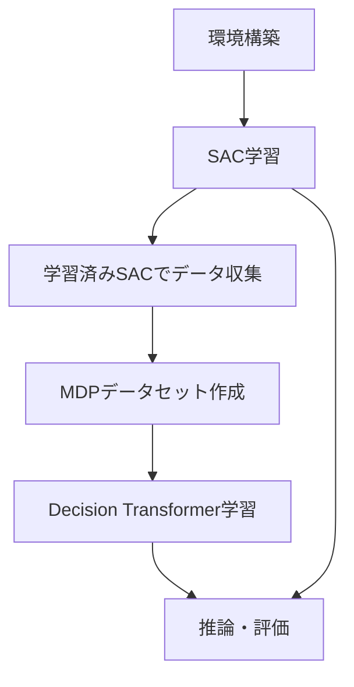
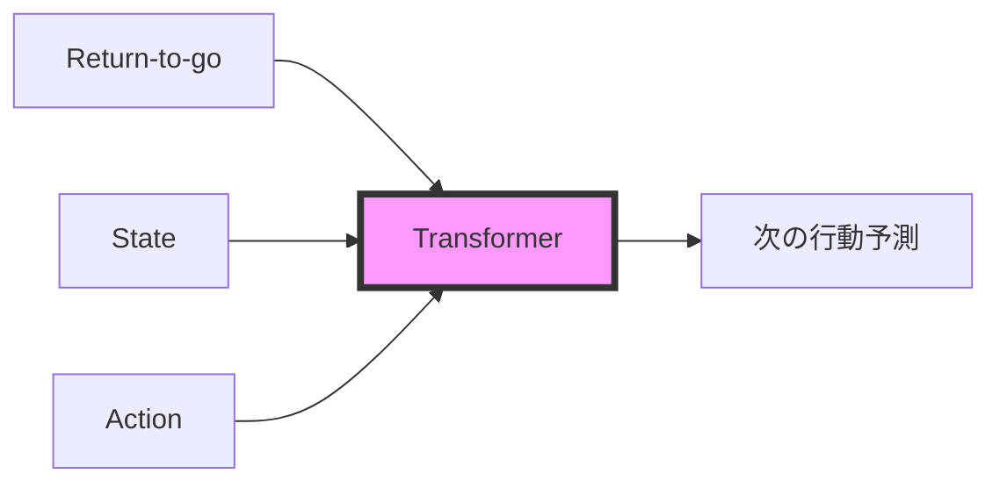

# このフォルダのプログラムについて

このフォルダのプログラムは、在庫に対しての最適量の発注を題材として、or-gymを用いて環境を組みつつ、d3rlpyライブラリーを用いてDecision Transformerを試してみたものになります。<br>また、比較としてstable-baseline3ライブラリーでのSACを用いました。<br>


## 在庫管理問題における強化学習の実装

Decision TransformerとSACを用いた在庫最適化

---

## 環境: MyInventoryEnv

- **状態空間**: 在庫量 + 納品待ち数(リードタイム分)
- **行動空間**: 発注量(0〜10)
  - 連続値または離散値で設定可能
- **リードタイム**: 発注から納品までの遅延期間
- **需要**: ポアソン分布(λ=3)からサンプリング

## 状態更新式
```
新在庫 = max(0, min(50, 現在在庫 - 需要 + 納品数))
```

---

## 報酬関数
- **目標在庫量**: 15
- **報酬計算**:
  ```
  delta = |在庫量 - 15|
  
  if 0 < delta < 5:    reward = 1.0
  elif 5 <= delta < 10: reward = 0
  else:                 reward = -delta × 0.1
  
  if 発注量 > 0:        reward -= 0.5
  ```

## 終了条件
- **terminated**: 在庫量が0になった場合
- **truncated**: 最大ステップ数(31)に到達した場合

---

## 学習フロー



---

## SAC (Soft Actor-Critic) 学習

**ハイパーパラメータ**
- 学習ステップ数: 51,200
- バッファサイズ: 2,048
- バッチサイズ: 64
- 学習率: 0.0003
- 割引率(γ): 0.98
- エントロピー係数: auto(自動調整)

---

## collect_data_by_trained_actor関数

学習済みSACモデルを使用して経験データを収集

- **収集データ数**: 50,000ステップ
- **推論モード**: 決定的(deterministic=True)
- **収集データ**:
  - 状態(state)
  - 行動(action)
  - 報酬(reward)
  - 終了フラグ(terminated)
  - 打ち切りフラグ(truncated)

---

## Decision Transformer 学習

**アーキテクチャ設定**
- バッチサイズ: 256
- コンテキストサイズ: 31(時系列長)
- Transformer層数: 2
- アテンションヘッド数: 1
- 学習率: 0.0001
- ドロップアウト率: 0.1(attention/residual/embedding)

**学習設定**
- 学習ステップ数: 30,000
- エポックあたりステップ数: 1,000

---

## Decision Transformerの仕組み



## 特徴
- **条件付き生成**: 目標リターン(target_return=15.0)を条件として行動を生成
- **系列モデリング**: 過去の状態・行動・報酬の系列から最適行動を予測
- **オフライン学習**: 事前収集データのみで学習

---

## 推論・評価

**inference_timestep関数**

両モデルで31ステップの推論を実行し、以下を記録:
- 在庫量(inventory): 現在の在庫数
- 利用可能在庫(available_inventory): 在庫量 + 納品待ち数の合計

**評価指標**
- ステップごとの在庫量推移
- 累積報酬
- 在庫切れの有無

---

## 結果の可視化

**プロット内容**
4つの系列を同時にプロット:
1. Decision Transformer - 在庫量
2. Decision Transformer - 利用可能在庫
3. SAC - 在庫量
4. SAC - 利用可能在庫

**比較ポイント**
- 目標在庫量(15)の維持能力
- 在庫変動の安定性
- 発注タイミングの適切性

---

## まとめ

**実装内容**
1. カスタム環境: リードタイムを考慮した在庫管理環境の構築
2. SAC学習: オンライン強化学習による方策獲得
3. データ収集: 学習済みモデルからの経験データ生成
4. Decision Transformer学習: オフライン強化学習の実行
5. 比較評価: 両手法の在庫管理性能の可視化

**技術的特徴**
- オンライン学習とオフライン学習の組み合わせ
- Transformerアーキテクチャの強化学習への応用
- 目標条件付き方策生成(goal-conditioned policy)

---