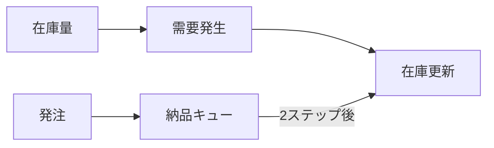
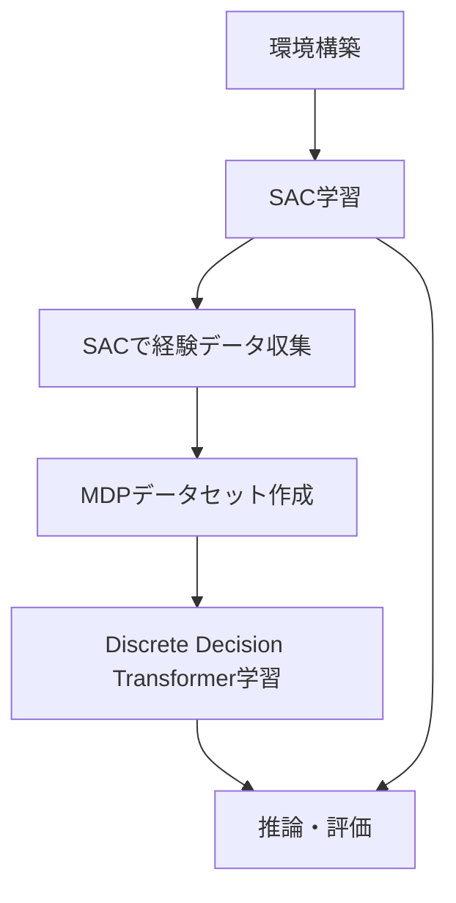
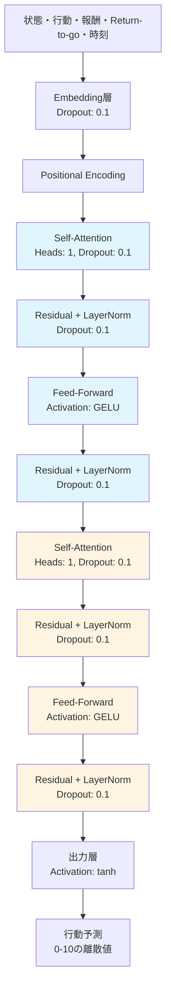

# このフォルダのプログラムについて

このフォルダのプログラムは、在庫に対しての最適量の発注を題材として、or-gymを用いて環境を組みつつ、d3rlpyライブラリーを用いてDiscrete Decision Transformerを試してみたものになります。<br>また、比較としてstable-baseline3ライブラリーでのSACを用いました。<br>


# 在庫管理問題における強化学習の実装

Discrete Decision Transformerを用いた在庫最適化

---

## 在庫管理環境 (MyInventoryEnv)

**環境の特徴**
- 状態: 現在の在庫量 + 納品待ち数(リードタイム分)
- 行動: 発注量(0〜10)
- 需要: ポアソン分布(λ=3)からサンプリング
- リードタイム: 2ステップ



---

## 報酬設計

**報酬関数**
```python
目標在庫量: 15
delta = |現在の在庫量 - 15|

if 0 < delta < 5:
    reward = 1.0
elif 5 <= delta < 10:
    reward = 0
else:
    reward = -(delta × 0.1)

# 発注コスト
if 発注量 > 0:
    reward -= 0.5
```

**終了条件**
- Terminated: 在庫量が0になった場合
- Truncated: 最大ステップ数(31)に到達

---

## 学習フロー



---

## SAC (Soft Actor-Critic) 学習

**パラメータ設定**
- 学習ステップ数: 51,200
- バッファサイズ: 2,048
- バッチサイズ: 64
- 割引率(γ): 0.98
- 学習率: 0.0003

## 特徴
- 連続的な行動空間を扱う
- オンライン学習(環境と相互作用しながら学習)
- エントロピー正則化による探索

---

## 経験データ収集

**データ収集プロセス**
```python
collect_data_by_trained_actor()
```

- 収集ステップ数: 50,000
- 推論モード: 決定的(deterministic=True)
- データ形式: (状態, 行動, 報酬, terminated, truncated)

**行動の変換**
- SACの連続的な行動 → 四捨五入 → 離散的な行動
- Discrete Decision Transformerの学習用に変換

---

## Discrete Decision Transformer 学習

**アーキテクチャ設定**
- バッチサイズ: 256
- コンテキストサイズ: 31(時系列長)
- Transformer層数: 2
- アテンションヘッド数: 1
- 割引率(γ): 1.0(return-to-go計算用)

**ドロップアウト率**
- Attention: 0.1
- Residual: 0.1
- Embedding: 0.1

---

## Transformer構造



---

## 推論・評価

**評価指標**
- 在庫量(inventory): 現在の在庫
- 利用可能在庫(available_inventory): 在庫量 + 納品待ち数の合計
- 累積報酬: 31ステップ分の報酬合計

**比較対象**
- SAC
- Discrete Decision Transformer(目標リターン=15.0)

---

## 可視化

**グラフ出力内容**
- 時系列での在庫量推移
- 時系列での利用可能在庫推移
- SAC vs Discrete Decision Transformer の比較

**プロット要素**
- X軸: ステップ数(1〜31)
- Y軸: 在庫数
- 4つの系列を同時表示

---

## まとめ

**実装内容**
1. カスタム環境: リードタイムを考慮した在庫管理環境
2. SAC学習: オンライン強化学習でベースライン構築
3. データ収集: SACの推論結果から経験データを生成
4. Discrete Decision Transformer学習: オフライン強化学習の実行
5. 性能比較: 両手法の在庫管理性能を可視化

**技術的特徴**
- オンライン学習とオフライン学習の組み合わせ
- Transformerアーキテクチャの強化学習への応用
- リードタイムを考慮した状態設計