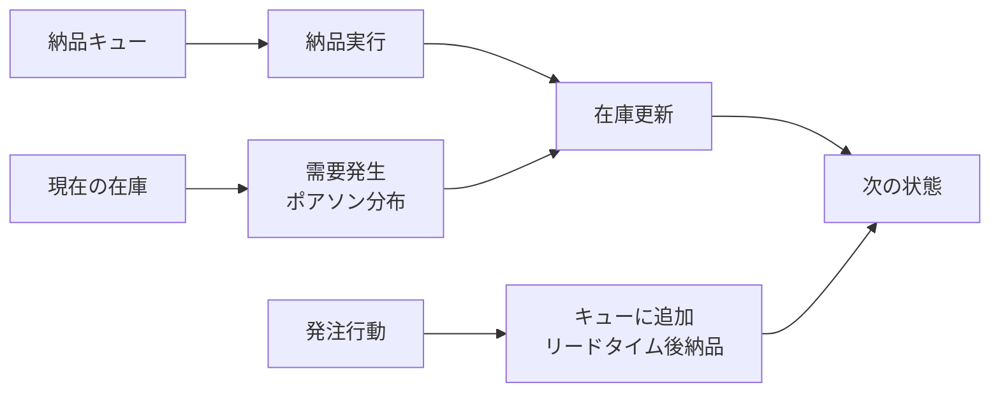
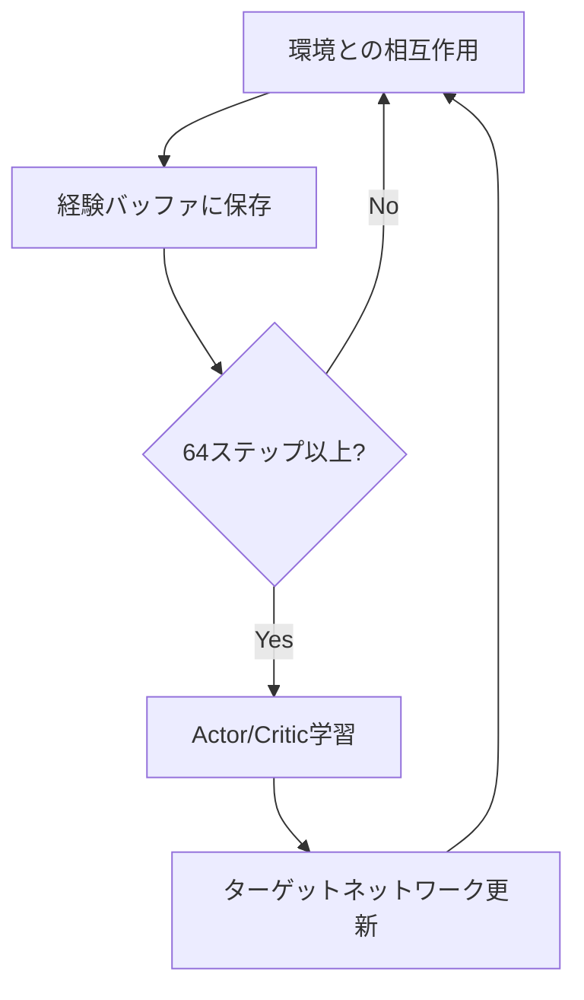
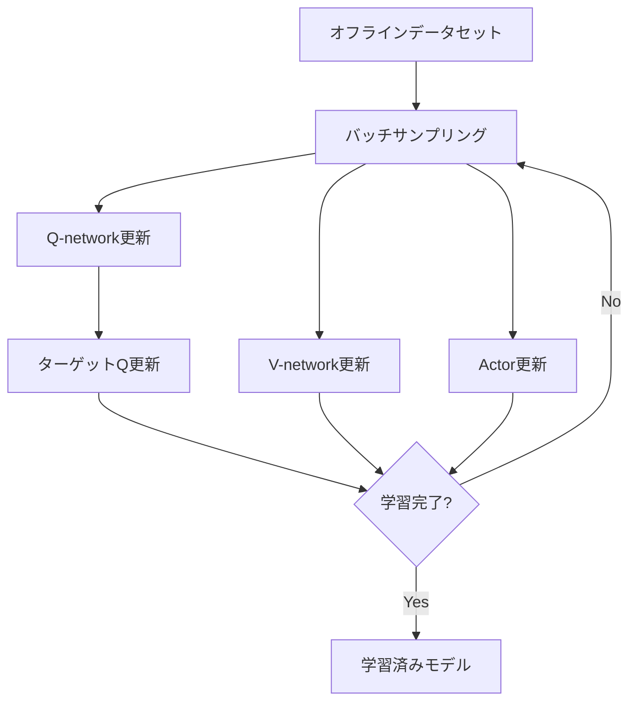

# このフォルダのプログラムについて

このフォルダのプログラムは、在庫に対しての最適量の発注を題材として、or-gymを用いて環境を組みつつ、d3rlpyライブラリーを用いてIQLを試してみたものになります。<br>また、比較としてstable-baseline3ライブラリーでのSACを用いました。<br>


# 在庫管理環境における強化学習プログラム

オフライン強化学習(IQL)とオンライン強化学習(SAC)の実装

---

## プログラム概要

- **目的**: 在庫管理問題を強化学習で解決
- **使用ライブラリ**: 
  - `gymnasium`: 環境構築
  - `stable_baselines3`: SAC実装
  - `d3rlpy`: IQL実装
- **処理フロー**:
  1. カスタム在庫管理環境の定義
  2. SACによるオンライン学習
  3. SACで収集したデータでIQLをオフライン学習
  4. 両モデルの推論結果を比較

---

## 環境: MyInventoryEnv

**環境パラメータ**
- 状態空間: 在庫量 + 納品待ち数(リードタイム分)
- 行動空間: 発注量(0〜10)
- リードタイム: 発注から納品までの遅延
- 需要: ポアソン分布(期待値=3)でサンプリング

**報酬設計**
- 在庫量15を目標値として設定
- 目標値からの乖離に応じて報酬を付与
- 発注時にコスト(-0.5)を課す
- 在庫切れ(在庫量=0)でエピソード終了

---

## 環境の状態遷移



---

## 報酬関数の詳細

```python
# 在庫数15を基準とした報酬
delta = abs(在庫量 - 15)

if 0 < delta < 5:
    reward = 1.0          # 目標付近
elif 5 <= delta < 10:
    reward = 0            # やや離れている
else:
    reward = -(delta * 0.1)  # 大きく離れている

# 発注コスト
if 発注量 != 0:
    reward -= 0.5
```

---

## SAC (Soft Actor-Critic) による学習

- **行動空間**: 連続値(0〜10)
- **学習ステップ**: 51,200ステップ
- **主要パラメータ**:
  - バッファサイズ: 2,048
  - バッチサイズ: 64
  - 割引率γ: 0.98
  - エントロピー係数: auto(自動調整)

---

## SACの学習プロセス



---

## データ収集フェーズ(collect_data_by_trained_actor関数)

- **目的**: 学習済みSACモデルで環境からデータ収集
- **収集データ量**: 50,000ステップ
- **推論モード**: 決定的(deterministic=True)
- **収集データ**:
  - 状態(observations)
  - 行動(actions)
  - 報酬(rewards)
  - 終了フラグ(terminals)
  - 打ち切りフラグ(timeouts)

---

## IQL (Implicit Q-Learning) によるオフライン強化学習

- **データソース**: SACで収集した50,000ステップのデータ
- **学習ステップ**: 50,000ステップ
- **主要パラメータ**:
  - バッチサイズ: 256
  - 割引率γ: 0.99
  - Expectile: 0.8
  - Weight temperature β: 10.0
  - Critic数: 2

---

## IQLの損失関数

**3つのネットワークの学習**

1. Q-network (Critic)
   - 損失: `targetQ - Q`
   - targetQ = `報酬 + γ × V(次状態)`

2. V-network (Value)
   - 損失: `重みE × (Q - V)`
   - Expectile E = 0.8

3. Actor (Policy)
   - 目的値: `exp(β × (Q - V)) × log π(a|s)`
   - QがVより高い行動の確率を増加

---

## IQL学習フロー



---

## 推論フェーズ(inference_timestep関数)

- **実行ステップ**: 31ステップ
- **評価指標**:
  - 各ステップの在庫量
  - 利用可能在庫量(在庫+納品待ち)
  - 累積報酬
- **比較対象**: SAC vs IQL

**出力情報**
- ステップごとの状態(在庫量、翌日納品、翌々日納品)
- 総報酬

---

## 結果の可視化

**プロット内容**
- IQL: 在庫量と利用可能在庫量の推移
- SAC: 在庫量と利用可能在庫量の推移
- X軸: ステップ数(1〜31)
- Y軸: 在庫数

**比較ポイント**
- オンライン学習(SAC)とオフライン学習(IQL)の性能差
- 在庫量15付近を維持できているか
- 在庫切れの発生有無

---