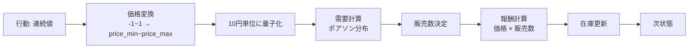
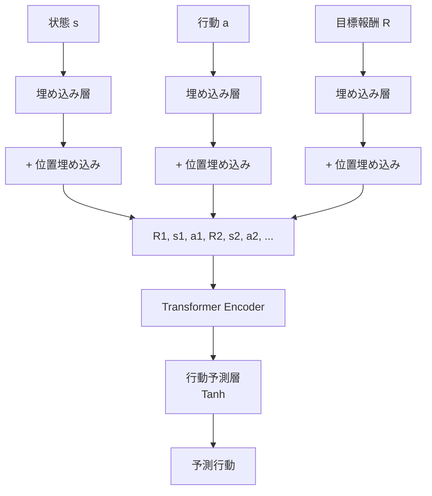
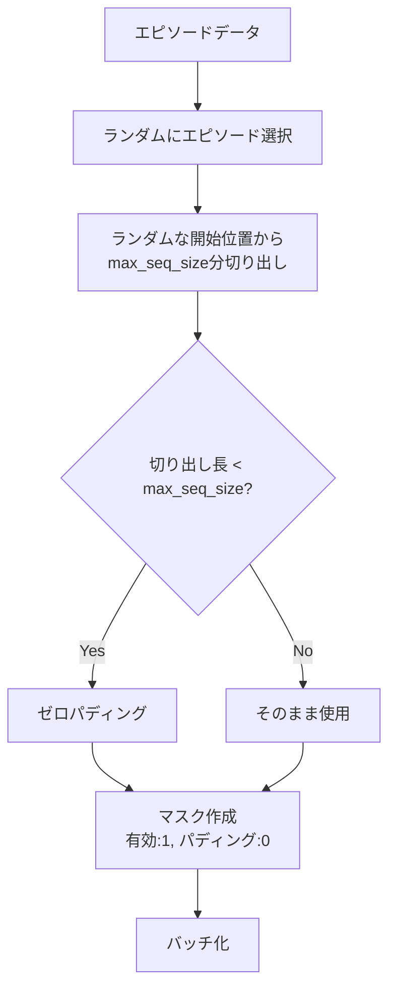
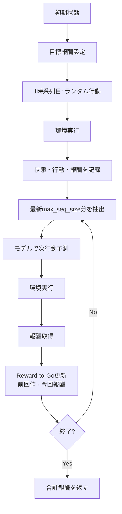

# このフォルダのプログラムについて

このフォルダのプログラムは、在庫に対して最適な価格を付けるタスクを題材として、環境およびDecision Transformerモデルを勉強も兼ねてスクラッチで組んでみたものになります。<br>

## プログラムの目的

- Decision Transformerを用いた強化学習による価格決定の最適化
- 在庫と残りステップ数を考慮した動的価格設定
- 目標報酬を指定することで、望ましい価格戦略を学習・実行

---

## 環境設定: PriceEnvironment

価格決定のシミュレーション環境

**主要パラメータ**
- `max_inventory`: 最大在庫数
- `max_step_count`: 最大ステップ数
- `price_min`, `price_max`: 価格の範囲

**状態表現**
- 残り在庫の割合
- 残りステップの割合

---

## 環境の動作フロー



---

## 需要モデル

**需要期待値の計算**
```
需要期待値 = (最高価格 / 現在価格) × (在庫 × 0.05)
```

- 価格が高い → 需要期待値が低い
- 価格が低い → 需要期待値が高い
- 在庫の5%を基準値として使用

**実際の需要**
- ポアソン分布から確率的にサンプリング
- 販売数 = min(需要, 在庫)

---

## Decision Transformerモデル構造



---

## モデルの詳細仕様

**入力**
- 状態: 2次元 (在庫割合, ステップ割合)
- 行動: 1次元 (連続値)
- 目標報酬: 1次元 (Reward-to-Go)

**アーキテクチャ**
- 埋め込み次元: 256
- Transformer層数: 5
- アテンションヘッド数: 8
- 最大系列長: 32 (MAX_STEP_COUNT + 1)

---

## データ収集プロセス

**collect_episode_datas関数**

1. ランダム行動で環境を実行 (一様分布: -1~1)
2. 各エピソードで記録:
   - 状態系列
   - 行動系列
   - 報酬系列

3. Reward-to-Goの計算:
   ```python
   報酬を逆順 → 累積和 → 再度逆順
   ```
   → 各時刻から終了までの累積報酬

---

## データセット作成

**create_dataset_for_model関数**



---

## 学習プロセス

**train_decision_transformer関数**

1. ミニバッチ作成: ランダムサンプリング + パディング
2. 順伝播: モデルで行動を予測
3. 損失計算: MSE損失 (マスク適用)
   ```python
   masked_loss = raw_loss × mask
   loss = masked_loss.sum() / mask.sum()
   ```
4. 逆伝播: パラメータ更新 (Adam)

**マスクの役割**
- パディング部分を損失計算から除外
- 有効なデータのみで学習

---

## Transformerのマスク機構

**Causal Mask (因果マスク)**

```python
mask_for_transformer = torch.triu(ones, diagonal=1)
```

- 上三角行列で未来の情報を遮断
- 時刻tでは時刻t以前の情報のみ参照可能
- 学習時のカンニング防止

**入力系列の構造**
```
R1, s1, a1, R2, s2, a2, R3, s3, a3, ...
```

---

## 推論プロセス

**inference_decision_transformer関数**



---

## 実行フロー全体

1. 環境とモデルの初期化
- 在庫: 100個
- ステップ数: 31
- 価格範囲: 100円~180円

2. データ収集
- 100エピソード分のランダム行動データ

3. 学習
- バッチサイズ: 10
- エポック数: 50
- 最適化: Adam (学習率 0.001)

---

## 実行フロー全体 (続き)

4. 学習結果の可視化
- 損失の推移グラフ
- エピソード毎の報酬和のヒストグラム

5. 推論実行
- 目標報酬: 12,250
- 学習済みモデルで価格戦略を実行
- 実際に得られた報酬と目標報酬を比較

6. 結果の可視化
- Reward-to-Goの推移
- 各ステップでの価格推移

---

## 主要な技術要素

**Decision Transformer**
- Transformerを用いた系列モデリング
- Reward-to-Goを条件として行動を生成
- オフライン強化学習の一手法

**特徴**
- 目標報酬を指定可能 (Goal-conditioned)
- 因果マスクによる自己回帰的予測
- 位置埋め込みによる時系列情報の保持
- パディングとマスクによる可変長系列の処理

---

## データ構造

**EpisodeDatas (Pydantic)**
```python
- state: np.ndarray        # 状態系列
- action: np.ndarray       # 行動系列
- reward_to_go: np.ndarray # 目標報酬系列
- seq: np.ndarray          # 時系列インデックス
```

**バッチデータの形状**
- state: (batch, max_seq_size, 2)
- action: (batch, max_seq_size, 1)
- reward_to_go: (batch, max_seq_size, 1)
- seq: (batch, max_seq_size)
- mask: (batch, max_seq_size)

---

## 可視化機能

1. 学習曲線
- 損失の推移をエポック毎にプロット

2. 報酬分布
- エピソード毎の合計報酬のヒストグラム
- 最高値と平均値を表示

3. 推論結果
- Reward-to-Goの時系列変化
- 各ステップでの決定価格の推移

---

## まとめ

**プログラムの実装内容**
1. 価格決定環境のシミュレータ構築
2. Decision Transformerモデルの実装
3. ランダム行動によるデータ収集
4. オフライン学習の実行
5. 目標報酬を条件とした推論
6. 結果の可視化と評価
