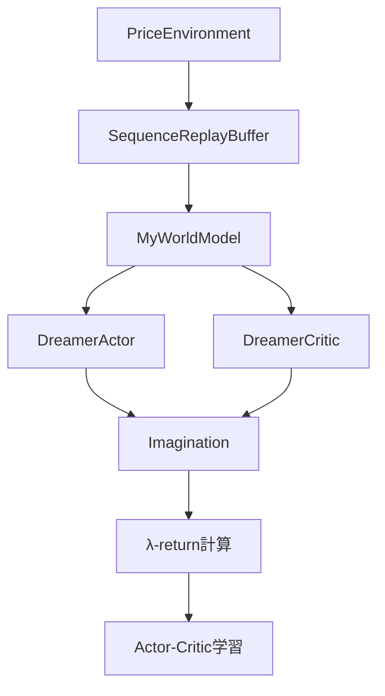
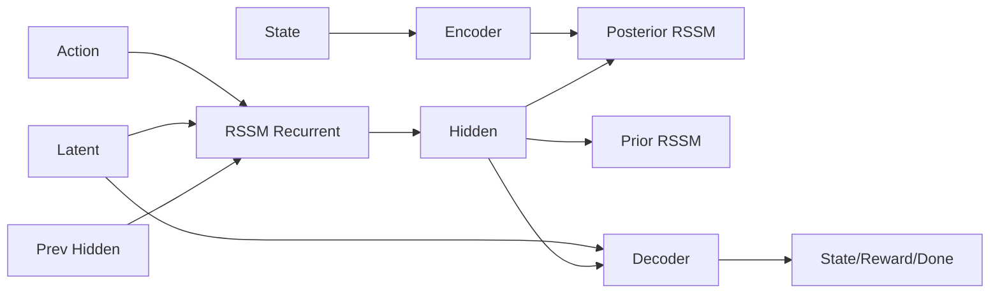
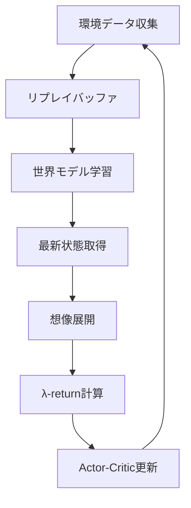
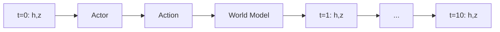

# このフォルダのプログラムについて

このフォルダのプログラムは、在庫に対して最適な価格を付けるタスクを題材として、環境およびSACモデルとMPCモデルを勉強も兼ねてスクラッチで組んでみたものになります。<br>


# Dreamer アルゴリズムによる価格最適化

## 概要
- 在庫管理環境での価格決定問題をDreamerアルゴリズムで解決
- 世界モデル（World Model）を学習し、想像上でのプランニングを実行
- Actor-Criticアーキテクチャによる強化学習

---

## システム構成



---

## 価格環境（PriceEnvironment）

**主要機能**
- 状態: [在庫割合, 残りステップ割合]
- 行動: 連続値の価格決定（-1～1 → 100～180円）
- 報酬: 価格 × 販売数量
- 需要モデル: ポアソン分布による確率的需要

**需要計算式**
```
需要期待値 = (最高価格 / 現在価格) × (在庫 × 0.05)
需要 = Poisson(需要期待値)
```

---

## 世界モデル（MyWorldModel）

**アーキテクチャ構成**



---

## RSSM（Recurrent State Space Model）

**主要コンポーネント**

1. RssmRecurrent
- GRUCellによる隠れ状態の更新
- 入力: 前時刻の潜在変数 + 行動 + 隠れ状態

2. PosteriorRssmStochastic
- 実データ（状態特徴量）と隠れ状態から事後分布を生成
- Straight-Through Estimatorによる離散潜在変数

3. PriorRssmStochastic
- 隠れ状態のみから事前分布を生成

---

## Straight-Through Estimator

**実装詳細**
```python
def straight_through_estimator(logits_data):
    dists = torch.distributions.OneHotCategorical(logits=logits_data)
    dists_probs = dists.probs  # softmax済み確率
    dists_samples = dists.sample()  # One-Hotサンプル
    ste = dists_samples + dists_probs - dists_probs.detach()
    return latent, dists
```

**特徴**
- 順伝播: サンプリング結果を使用
- 逆伝播: 微分可能な確率値を使用

---

## 学習プロセス



---

## 世界モデル学習

**損失関数**
1. 状態再構成損失: MSE(予測状態, 実際状態)
2. 報酬予測損失: MSE(予測報酬, 実際報酬)
3. 終了予測損失: BCE(予測終了, 実際終了)
4. KLダイバージェンス損失: KL(事後分布, 事前分布)

**KL損失の特徴**
- バランシング係数: 0.8（事後分布重視）
- 閾値設定: 1.0（ゼロ回避）

---

## 想像展開（Imagination）

**プロセス**
1. 最新の隠れ状態・潜在変数から開始
2. Actorで行動を生成
3. 世界モデルで次状態を予測
4. 指定ホライゾン（10ステップ）まで繰り返し



---

## λ-return計算

**計算式**
```
Gt = rt + γ((1 - λ) * Vt+1 + λ * Gt+1)
```

**パラメータ**
- γ (割引率): 0.99
- λ (TD-MC重み): 0.95
- TD法とモンテカルロ法の組み合わせ
- ゴール地点から逆算で計算

---

## Actor-Critic学習

**DreamerActor**
- 入力: 隠れ状態 + 潜在変数
- 出力: 正規分布のパラメータ（μ, σ）
- 行動: tanh(正規分布サンプル)

**DreamerCritic**
- 入力: 隠れ状態 + 潜在変数
- 出力: 状態価値

**損失関数**
- Actor損失: -λ-return の平均
- Critic損失: MSE(状態価値, λ-return)

---

## 学習スケジュール

**フェーズ分け**
1. 初期20エポック: 世界モデルのみ学習
2. 残り80エポック: 全体同時学習

**各エポックの流れ**
1. 環境データ収集（100ステップ）
2. バッチデータ取得（32バッチ、30時系列）
3. 世界モデル学習
4. Actor-Critic学習（20エポック後から）

---

## 主要ハイパーパラメータ

| パラメータ | 値 |
|-----------|---|
| 最大在庫 | 100 |
| 最大ステップ | 31 |
| 価格範囲 | 100-180円 |
| 隠れ次元 | 400 |
| 潜在変数次元 | 256 (16×16) |
| バッチサイズ | 32 |
| 想像ホライゾン | 10 |
| 学習率 | 0.001 |
