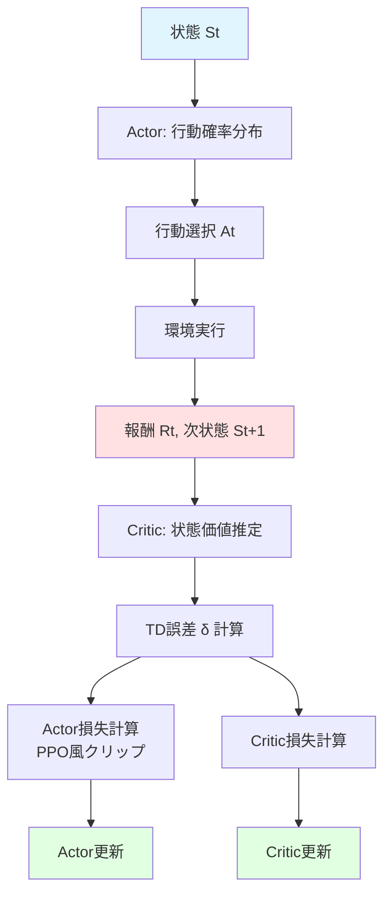
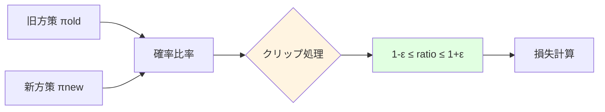
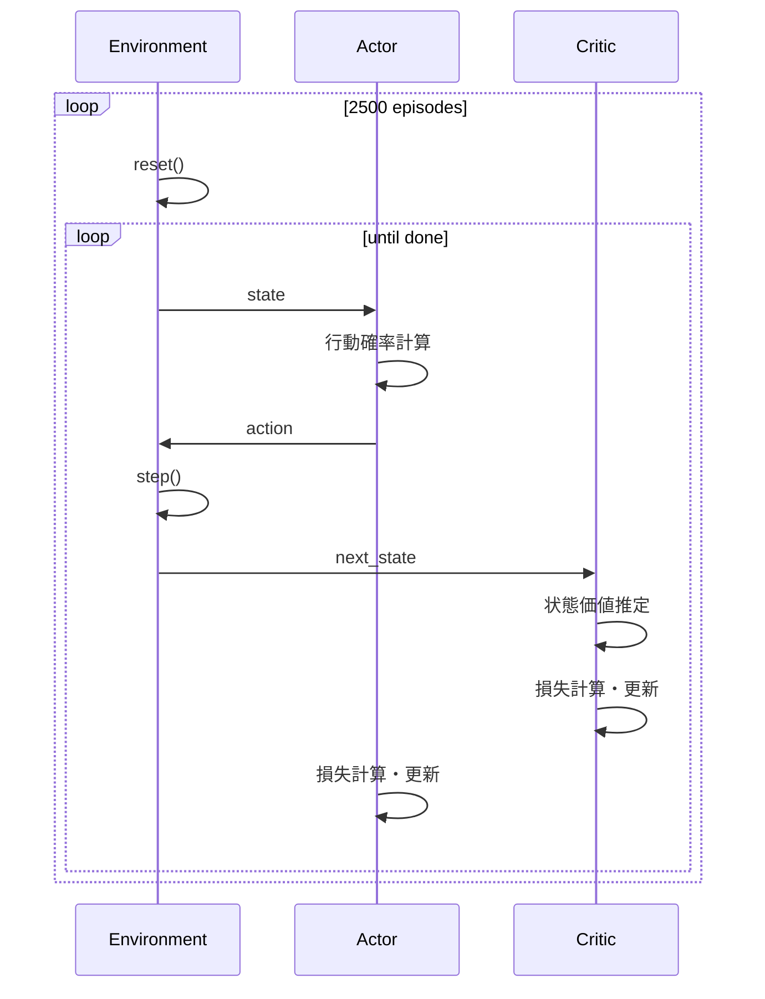

# このフォルダのプログラムについて

このフォルダのプログラムは、在庫に対して最適な価格を付けるタスクを題材として、環境およびPPO(仮)モデルを勉強も兼ねてスクラッチで組んでみたものになります。<br>


# プログラムの目的

在庫を持つ環境において、最適な価格設定を学習する強化学習システム

- 環境: 在庫管理シミュレーション
- 学習手法: Actor-Critic (PPO風のクリップ機構を含む)
- 目標: 総報酬(売上)の最大化

---

## 環境設定

**パラメータ**
- 最大在庫: 100個
- 最大ステップ数: 31ステップ
- 価格選択肢: [100, 120, 140, 160, 180]

**状態表現**
```
状態 = [残り在庫の割合, 残りステップの割合]
```

2次元の連続値で環境の状態を表現

---

## 需要モデルの仕組み


**計算式**
```
需要期待値 = (最高価格 / 選択価格) × (在庫 × 0.05)
実際の需要 ~ Poisson(需要期待値)
販売数 = min(在庫, 需要)
報酬 = 価格 × 販売数
```

---

## ニューラルネットワーク構造

**Actor ネットワーク**
```
入力(状態: 2次元) 
  ↓
全結合層(64ユニット) + ReLU
  ↓
全結合層(5ユニット) + Softmax
  ↓
出力(行動確率分布: 5次元)
```

**Critic ネットワーク**
```
入力(状態: 2次元)
  ↓
全結合層(64ユニット) + ReLU
  ↓
全結合層(1ユニット)
  ↓
出力(状態価値: スカラー)
```

---

## 学習アルゴリズムの流れ



---

## 学習ループの詳細

**エピソードごとの処理**
1. 環境をリセット
2. 終了条件まで以下を繰り返し:
   - Actorで行動確率を計算(新方策 πθ)
   - 確率分布から行動を選択
   - 環境でステップ実行
   - 報酬と次状態を取得
   - Criticで状態価値を推定
   - 損失を計算して両モデルを更新

**学習パラメータ**
- エピソード数: 2500
- 割引率 γ: 0.98
- クリップ範囲 ε: 0.2
- 学習率: 0.001 (Adam)

---

## 損失関数の計算

**Critic損失(MSE)**
```
target = Rt + γ × V(St+1)
loss_critic = MSE(V(St), target)
```

**Actor損失(PPO風クリップ)**
```
ratio = πθ(At|St) / πold_θ(At|St)
ratio_clip = clip(ratio, 1-ε, 1+ε)
δ = Rt + γ×V(St+1) - V(St)
loss_actor = -min(ratio × δ, ratio_clip × δ)
```

---

## PPO風の確率比率クリップ



方策の急激な変化を防ぐ機構
※TD法ベースのため厳密なPPOではない

---

## 学習の実行フロー


