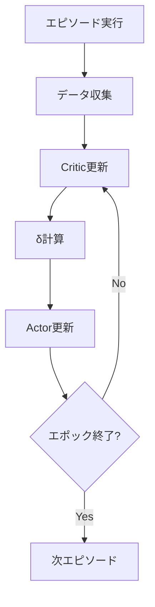
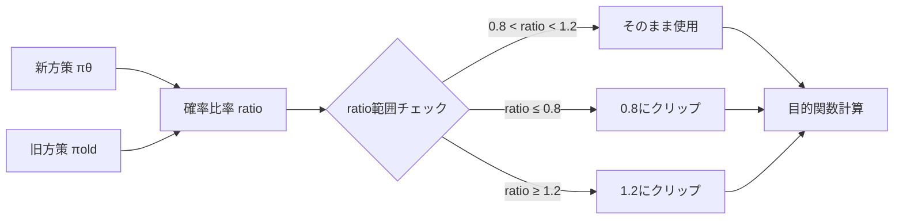
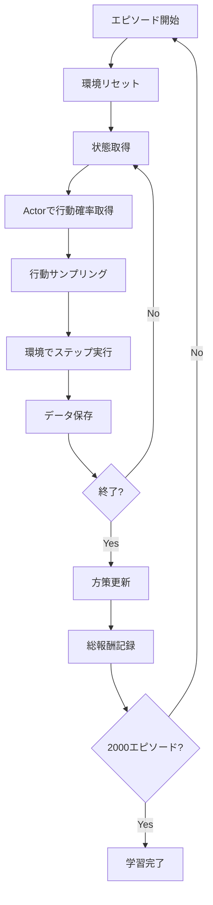

# このフォルダのプログラムについて

このフォルダのプログラムは、在庫に対して最適な価格を付けるタスクを題材として、環境およびPPOモデルを勉強も兼ねてスクラッチで組んでみたものになります。<br>


# PPO (Proximal Policy Optimization) による在庫管理

## プログラム概要

- 目的: 在庫を最適な価格で販売し、総報酬を最大化
- 手法: PPO (Proximal Policy Optimization) アルゴリズム
- 環境: 在庫数と残りステップ数を考慮した価格決定問題

---

## 環境設定

**パラメータ**
- 最大在庫数: 100
- 最大ステップ数: 31
- 価格選択肢: [100, 120, 140, 160, 180]

**状態表現**
```python
STATE = [残り在庫の割合, 残りステップの割合]
```
- 2次元の連続値ベクトル
- 各要素は0.0〜1.0の範囲

---

## 需要モデルのフロー


---

## ニューラルネットワーク構造

**MyActor (方策ネットワーク)**
```
入力層 (2次元) → 隠れ層 (64ユニット, ReLU) 
                → 出力層 (5次元, Softmax)
```
- 出力: 各価格を選択する確率分布

**MyCritic (価値ネットワーク)**
```
入力層 (2次元) → 隠れ層 (64ユニット, ReLU) 
                → 出力層 (1次元)
```
- 出力: 状態価値 V(s)

---

## PPOアルゴリズムの構造



---

## Critic更新 (update_critic)

**モンテカルロ法による価値推定**

1. リターン計算 (逆順に計算)
   ```
   G = reward (done=1の場合)
   G = reward + γ × G (done=0の場合)
   ```

2. 損失関数
   ```
   Loss = MSE(V(s), G)
   ```
   - V(s): Criticの予測値
   - G: モンテカルロリターン (目標値)

3. TD誤差 (δ) の計算
   ```
   δ = G - V(s)
   ```

---

## Actor更新 (update_actor)

**PPOの目的関数**

1. 確率比率の計算
   ```
   ratio = πθ(a|s) / πold(a|s)
   ```

2. クリップされた目的関数
   ```
   L = min(ratio × δ, clip(ratio, 1-ε, 1+ε) × δ)
   ```
   - ε = 0.2 (PPO_EPSILON)

3. 損失関数
   ```
   Loss = -mean(L)
   ```

---

## PPOのクリッピング機構



---

## 学習ループ (update_policy)

**処理フロー**

1. エピソードデータから各要素を抽出
   - 状態、行動、報酬、次状態、終了フラグ

2. 旧方策 πold を保存 (detach)

3. 指定エポック数 (5回) 繰り返し:
   - Critic更新 → δ計算
   - Actor更新

---

## メインループ



---

## ハイパーパラメータ

| パラメータ | 値 | 説明 |
|----------|-----|------|
| GAMMA | 0.98 | 割引率 |
| PPO_EPSILON | 0.2 | クリッピング範囲 |
| 学習率 (Actor) | 0.001 | Adam optimizer |
| 学習率 (Critic) | 0.001 | Adam optimizer |
| エピソード数 | 2000 | 総学習エピソード |
| 更新エポック数 | 5 | 1エピソードあたり |

---

## プログラムの特徴

1. **Actor-Critic アーキテクチャ**
   - Actor: 方策を学習
   - Critic: 状態価値を学習

2. **PPOアルゴリズム**
   - 方策の急激な変化を抑制
   - 安定した学習を実現

3. **モンテカルロ法**
   - エピソード全体のリターンで価値を推定

4. **確率的需要モデル**
   - ポアソン分布による現実的な需要生成
