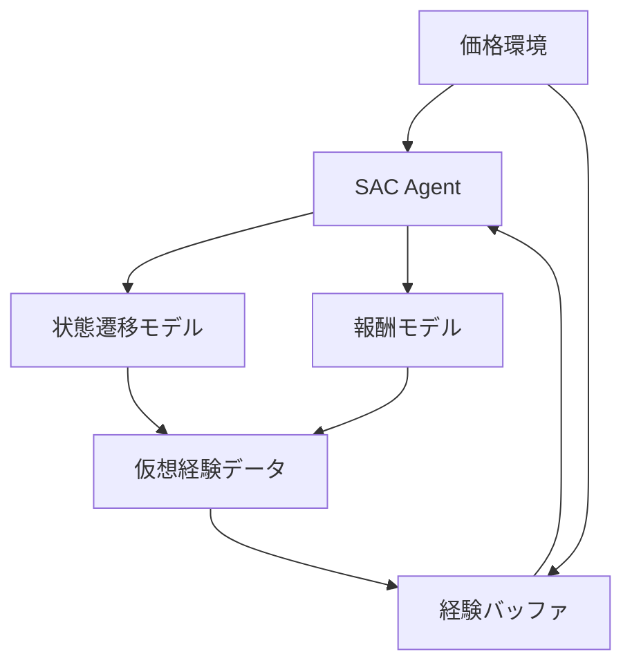
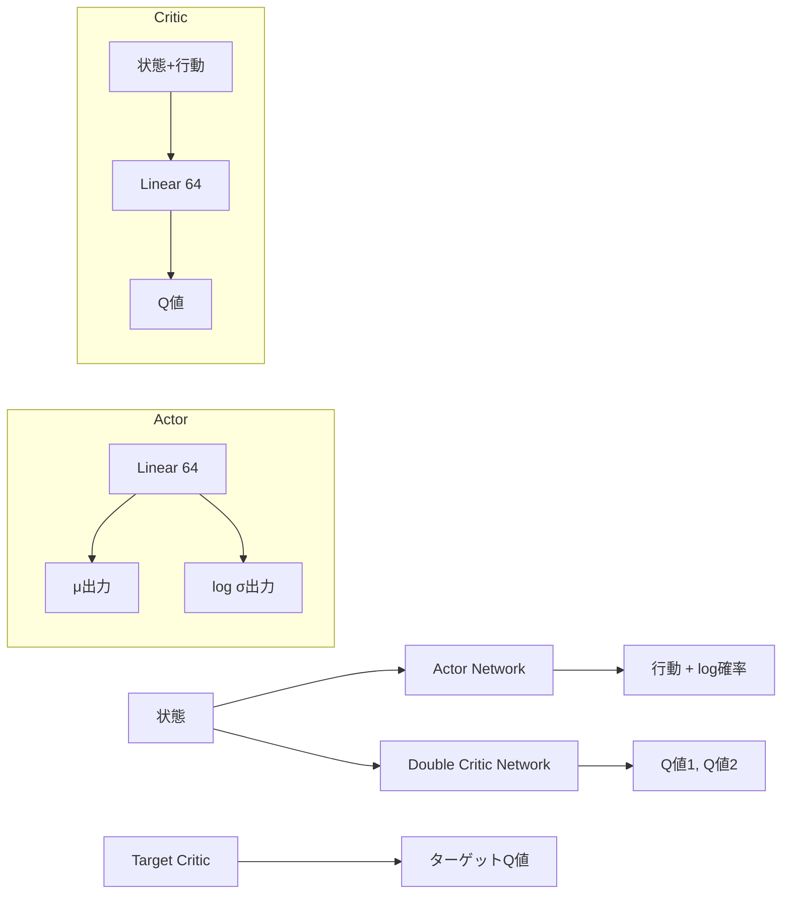
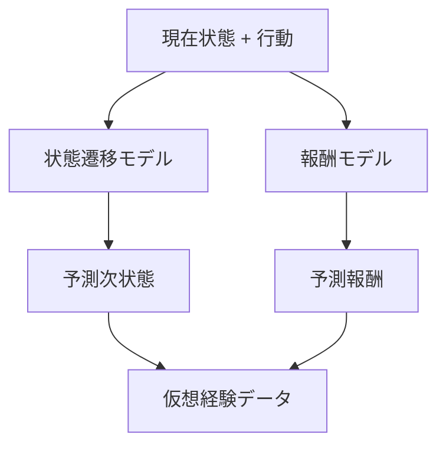
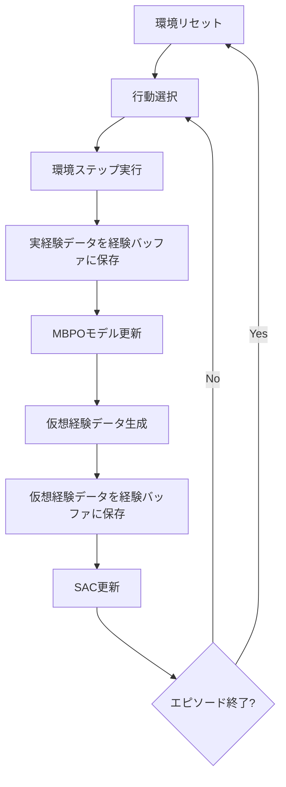
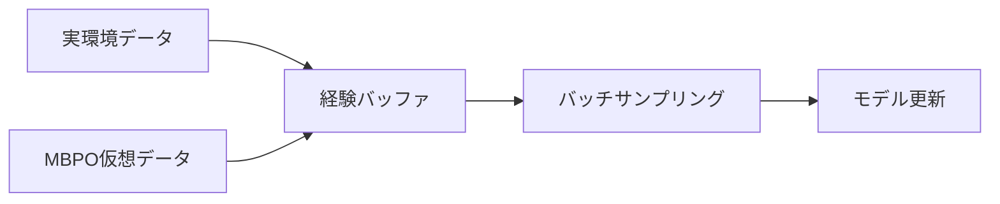

# このフォルダのプログラムについて

このフォルダのプログラムは、在庫に対して最適な価格を付けるタスクを題材として、環境およびSACモデルとMPCモデルを勉強も兼ねてスクラッチで組んでみたものになります。<br>


# MBPO (Model-Based Policy Optimization) による価格最適化

強化学習を用いた在庫管理における価格決定システムの実装

---

## システム概要



- 環境: 在庫管理における価格決定問題
- エージェント: SAC (Soft Actor-Critic) アルゴリズム
- モデル: 状態遷移と報酬を予測するニューラルネットワーク

---

## 価格環境 (PriceEnvironment)

**状態空間**
- 在庫割合: 現在の在庫 / 最大在庫 (0-1)
- ステップ割合: 残りステップ / 最大ステップ (0-1)

**行動空間**
- 価格設定: 連続値 (-1 to 1) → 価格範囲 (100-180) にマッピング

**報酬関数**
```
需要期待値 = (最高価格 / 設定価格) × (在庫 × 0.05)
実需要 = ポアソン分布(需要期待値)
売上在庫 = min(在庫, 需要)
報酬 = 価格 × 売上在庫
```

---

## SAC (Soft Actor-Critic) アーキテクチャ



**主要コンポーネント**
- Actor: 状態から行動の確率分布を出力
- Double Critic: 2つのQ関数で過大評価を防止
- Target Critic: 安定した学習のためのターゲットネットワーク

---

## MBPO モデル構造

**状態遷移モデル (MyStateTransitionModel)**
```python
入力: [状態, 行動] → 隠れ層(64) → 次状態(2次元)
```

**報酬モデル (MyRewardModel)**
```python
入力: [状態, 行動] → 隠れ層(64) → 報酬(1次元)
```



---

## 学習プロセス



**更新頻度**
- 状態遷移・報酬モデル: 毎ステップ
- Critic: 毎ステップ × 2回
- Actor: 毎ステップ × 1回
- Target Critic: 毎ステップ (ソフト更新)

---

## 経験バッファ (ReplayBuffer)

**データ構造**
```python
(状態, 行動, 報酬, 次状態, 終了フラグ, MBPO判定フラグ)
```

**データ取得オプション**
- 実データのみ: モデル学習用
- 仮想データのみ: 特定用途
- 混合データ: SAC学習用



---

## 主要パラメータ

| パラメータ | 値 | 説明 |
|-----------|-----|------|
| MAX_INVENTORY | 100 | 最大在庫数 |
| MAX_STEP_COUNT | 31 | 最大ステップ数 |
| PRICE_MIN/MAX | 100/180 | 価格範囲 |
| GAMMA | 0.98 | 割引率 |
| TAU | 0.005 | ターゲット更新率 |
| MBPO_STEP_PER_EPISODE | 5 | エピソード毎の仮想ステップ数 |
| REPLAY_BUFFER_MAX_SIZE | 50000 | 経験バッファサイズ |
