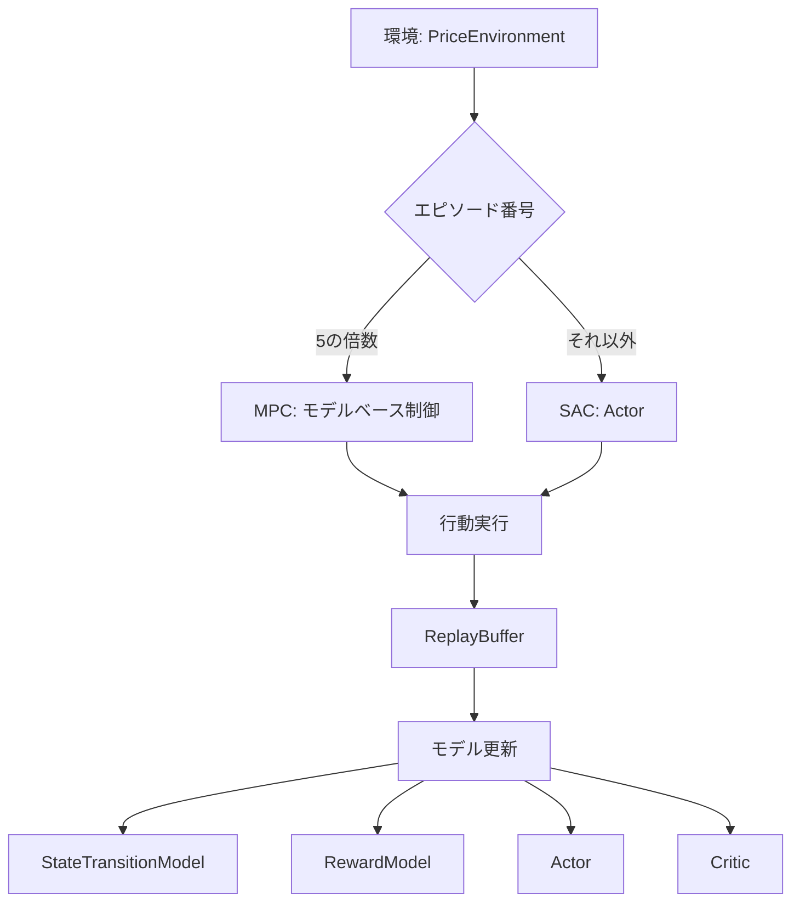
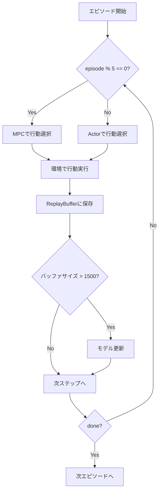
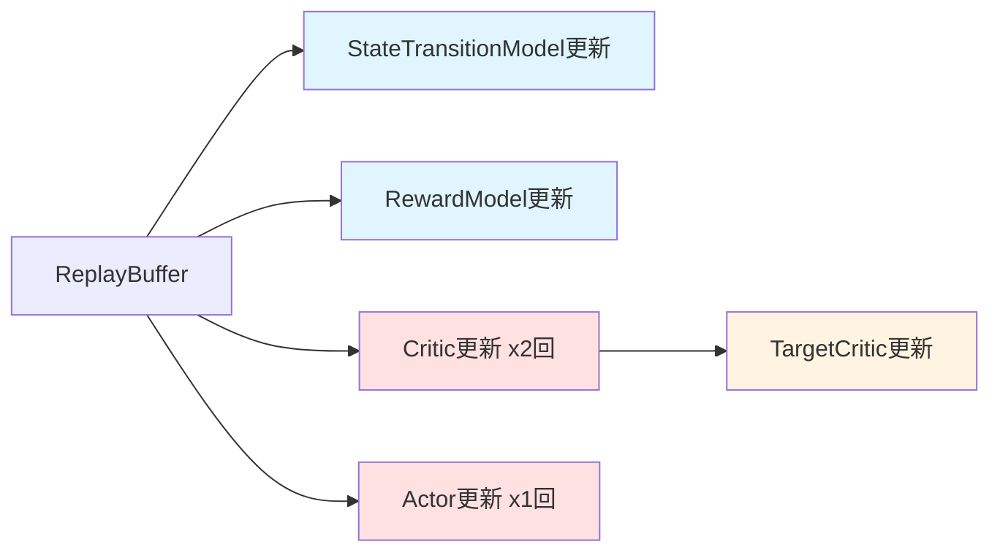

# このフォルダのプログラムについて

このフォルダのプログラムは、在庫に対して最適な価格を付けるタスクを題材として、環境およびSACモデルとMPCモデルを勉強も兼ねてスクラッチで組んでみたものになります。<br>


# プログラム概要
## 動的価格設定問題における強化学習

本プログラムは、在庫販売における最適な価格設定を学習するシステムです。
SAC (Soft Actor-Critic)とMPC (Model Predictive Control)を組み合わせた手法を実装しています。

---

## 環境 (PriceEnvironment)

- **状態**: [在庫割合, 残りステップ割合]
- **行動**: 価格設定 (100円～180円の連続値)
- **報酬**: 売上 = 価格 × 販売数量
- **制約**: 
  - 最大在庫: 100個
  - 最大ステップ数: 31ステップ
  - 需要はポアソン分布に従う確率的な値

---

## システムアーキテクチャ



---

## SAC関連モデル

- **Actor**: 状態から行動(価格)を出力
  - 正規分布のパラメータ(μ, log σ)を出力
  - tanh関数で-1～1の連続値に変換
  
- **DoubleCritic**: 状態と行動から行動価値Q値を出力
  - 2つのCriticで過大評価を抑制

---

## MPC関連モデル

- **StateTransitionModel**: 次状態を予測
  - 入力: 現在の状態 + 行動
  - 出力: 次の状態
  
- **RewardModel**: 報酬を予測
  - 入力: 現在の状態 + 行動
  - 出力: 報酬値

---

## 学習フロー



---

## MPC (Model Predictive Control)

**動作原理**

1. ランダムサンプリング: n_trial回(20回)の試行を実行
2. ホライゾン予測: 各試行でhorizon_step(5ステップ)先まで予測
3. 最良行動選択: 累積報酬が最大となる試行の1ステップ目の行動を採用

```python
for trial in range(n_trial):
    for step in range(horizon_step):
        action = random_action()
        next_state = StateTransitionModel(state, action)
        reward = RewardModel(state, action)
        total_reward += reward
```

---

## SAC (Soft Actor-Critic)

**Actor更新アルゴリズム**

損失関数: $L_\pi = \mathbb{E}[-Q(s,a) + \alpha \log \pi(a|s)]$

- Q値の最大化(報酬の最大化)
- エントロピーの最大化(探索の促進)

**Critic更新アルゴリズム**

ターゲットQ値: $y = r + \gamma(Q_{target}(s', a') - \alpha \log \pi(a'|s'))$

損失関数: $(Q_1(s,a) - y)^2 + (Q_2(s,a) - y)^2$

---

## ReplayBuffer

**データ管理**

- 最大サイズ: 50,000
- 保存データ: (state, action, reward, next_state, done, is_mpc)
- is_mpcフラグ: MPCとActorのデータを区別

**バッチサンプリング**

```python
get_batch_data(batch_size, is_mpc)
```

- `is_mpc=True`: MPCデータのみ → モデル学習用
- `is_mpc=False`: Actorデータのみ → Actor学習用
- `is_mpc=None`: 全データ → Critic学習用

---

## モデル更新の流れ



- **MPC用モデル**: is_mpc=Trueのデータで学習
- **Actor**: is_mpc=Falseのデータで学習
- **Critic**: 全データで学習

---

## 需要モデル

**ポアソン分布による確率的需要**

```python
demand_expectation = int((price_max / price) * (inventory * 0.05))
demand = np.random.poisson(lam=demand_expectation)
saled_inventory = min(inventory, max(demand, 0))
reward = price * saled_inventory
```

- 需要期待値: 在庫の5% × (最高価格/現在価格)
- 価格が低い → 需要期待値が高い
- 価格が高い → 需要期待値が低い

---

## 学習パラメータ

| パラメータ | 値 | 説明 |
|----------|-----|------|
| エピソード数 | 2000 | 学習の総エピソード数 |
| バッチサイズ | 64 | モデル更新時のバッチサイズ |
| 割引率 γ | 0.98 | 将来報酬の割引率 |
| エントロピー係数 α | 0.9 | 探索の重み |
| TAU | 0.005 | TargetCritic更新の学習率 |
| Critic更新回数 | 2 | 1ステップあたりの更新回数 |

---

## 学習結果の可視化

プログラムの最後で、各エピソードの累積報酬をプロットしています。

```python
plt.plot(range(len(total_reward_list)), total_reward_list)
```

- **横軸**: エピソード番号
- **縦軸**: エピソードごとの総報酬(売上)

学習が進むにつれて、より高い売上を達成する価格設定戦略を獲得します。

---

## まとめ

**本プログラムの特徴**

1. SAC + MPC のハイブリッド手法
   - MPCで探索的なデータ収集
   - SACで方策の最適化

2. モデルベース強化学習
   - 環境のダイナミクスを学習
   - サンプル効率の向上

3. 動的価格設定問題への適用
   - 在庫制約と時間制約
   - 確率的需要への対応
