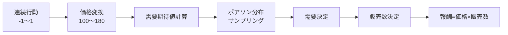
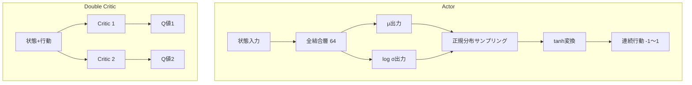
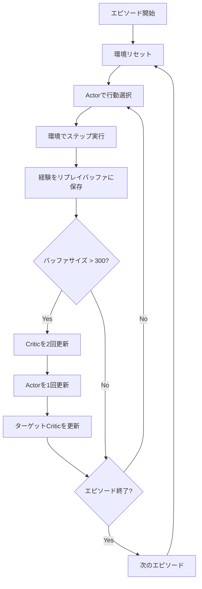
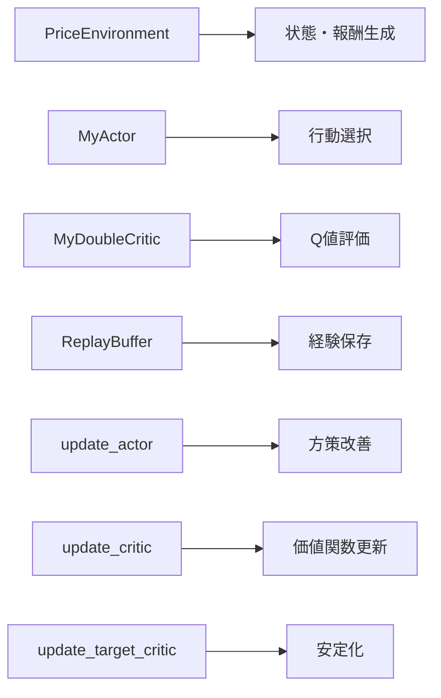

# このフォルダのプログラムについて

このフォルダのプログラムは、在庫に対して最適な価格を付けるタスクを題材として、環境およびSACモデルを勉強も兼ねてスクラッチで組んでみたものになります。<br>


# Soft Actor-Critic (SAC) による動的価格最適化

価格設定環境における強化学習の実装

---

## プログラム概要

- **目的**: 在庫販売における最適な価格設定戦略の学習
- **手法**: Soft Actor-Critic (SAC) アルゴリズム
- **環境**: 在庫と残りステップ数を考慮した価格決定問題
- **実装**: PyTorchによるニューラルネットワークモデル

---

## 環境設定 (PriceEnvironment)

**パラメータ**
- 最大在庫数: 100
- 最大ステップ数: 31
- 価格範囲: 100 ～ 180

**状態表現**
```
[残り在庫の割合, 残りステップの割合]
```

---

## 環境のダイナミクス



### 需要モデル
- 需要期待値 = (最高価格 / 価格) × (在庫 × 0.05)
- 実際の需要はポアソン分布から確率的に生成

---

## SACアーキテクチャ



---

## Actorモデル (MyActor)

**構造**
- 入力: 状態 (2次元)
- 隠れ層: 64ユニット (ReLU)
- 出力: μ と log σ (各1次元)

**行動生成プロセス**
1. 正規分布 N(μ, σ) からサンプリング (Reparameterization Trick使用)
2. tanh関数で -1 ～ 1 の範囲に変換
3. ヤコビアン補正でlog確率を調整

---

## Criticモデル (MyDoubleCritic)

**Double Q-Learning**
- 2つの独立したCriticネットワークを使用
- 過大評価バイアスを軽減

**構造**
- 入力: 状態 + 行動
- 隠れ層: 64ユニット (ReLU)
- 出力: Q値 (1次元)

---

## 学習アルゴリズムフロー



---

## Critic更新

**損失関数**
```
Loss = (Q1(s,a) - target_Q)² + (Q2(s,a) - target_Q)²
```

**ターゲットQ値**
```
target_Q = r + γ × (min(Q1', Q2') - α × log π(a'|s')) × (1 - done)
```

- γ = 0.98 (割引率)
- α = 0.9 (エントロピー係数)
- min(Q1', Q2'): 2つのターゲットCriticの小さい方

---

## Actor更新

**損失関数**
```
Loss = E[−Q(s,a) + α × log π(a|s)]
```

**目的**
- Q値の最大化 (報酬の最大化)
- エントロピーの最大化 (探索の促進)

**更新頻度**
- Critic: 2回/ステップ
- Actor: 1回/ステップ

---

## ターゲットネットワーク更新

**Soft Update方式**
```
θ_target = τ × θ_source + (1 - τ) × θ_target
```

- τ = 0.005 (更新率)
- 学習の安定化のため緩やかに更新

---

## リプレイバッファ (ReplayBuffer)

**機能**
- 経験データの保存: (状態, 行動, 報酬, 次状態, 終了フラグ)
- 最大サイズ: 300
- ランダムサンプリング: バッチサイズ 32

**目的**
- 経験の再利用
- データ間の相関を減らす
- 学習の安定化

---

## 学習プロセス

**ハイパーパラメータ**
- エピソード数: 2000
- バッチサイズ: 32
- 学習率: 0.001 (Actor/Critic共通)
- 報酬スケーリング: 1/200 (学習時)

**報酬スケーリング**
- SACは報酬の値に敏感
- 学習時に報酬を200で割る
- 記録時には元のスケールに戻す

---

## 実装の主要コンポーネント



---

## 学習結果の可視化

- 各エピソードの総報酬を記録
- 2000エピソードの学習曲線をプロット
- 学習の進行に伴う性能向上を確認
