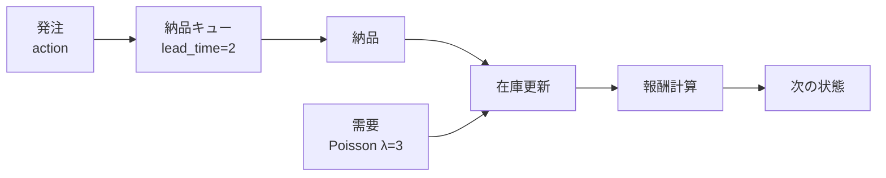
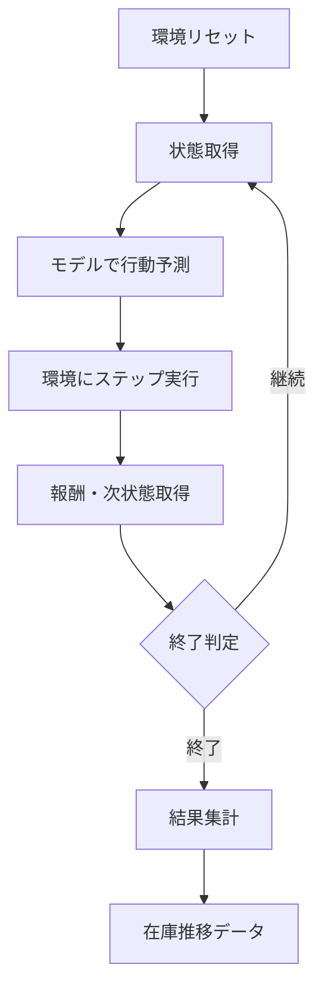
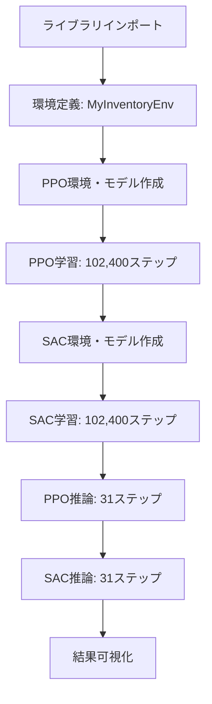

# このフォルダのプログラムについて

このフォルダのプログラムは、在庫に対しての最適量の発注を題材として、or-gymを用いて環境を組みつつ、stable-baseline3ライブラリーを用いてPPOとSACを試してみたものになります。<br>


## プログラムの目的

- **在庫管理環境のシミュレーション**
  - カスタムGym環境(`MyInventoryEnv`)の実装
  - リードタイムを考慮した発注・納品プロセス

- **強化学習アルゴリズムの適用**
  - PPO (Proximal Policy Optimization) - 離散行動
  - SAC (Soft Actor-Critic) - 連続行動

- **学習済みモデルの評価と可視化**

---

## 環境構成: MyInventoryEnv

**主要パラメータ**
- 初期在庫: 20個
- 最大ステップ数: 31ステップ/エピソード
- リードタイム: 2日（発注から納品まで）
- 需要: ポアソン分布（期待値=3）

**行動空間**
- 離散行動 (PPO用): 0〜10の整数値
- 連続行動 (SAC用): 0〜10の実数値

**状態空間**
- 現在の在庫量、翌日納品予定数、翌々日納品予定数

---

## 環境のフロー



---

## 報酬設計

**在庫量に基づく報酬（目標在庫: 15個）**

| 在庫量と目標の差 (δ) | 報酬 |
|:---:|:---:|
| 0 < δ < 5 | +1.0 |
| 5 ≤ δ < 10 | 0 |
| δ ≥ 10 | -δ × 0.1 |

**ペナルティ**
- 発注コスト: 発注時に -0.5
- 在庫切れ: エピソード終了 (terminated=True)

---

## PPOモデルの学習設定

```python
model_ppo = sb3.PPO(
    policy="MlpPolicy",
    env=env_ppo,
    learning_rate=0.001,
    n_steps=2048,        # バッファサイズ
    batch_size=64,       # ミニバッチサイズ
    n_epochs=10,         # 更新回数
    gamma=0.98,          # 割引率
    gae_lambda=0.95,     # GAEパラメータ
    clip_range=0.2       # クリッピング範囲
)
```

- 総学習ステップ数: 102,400
- 行動タイプ: 離散（0〜10の整数）

---

## SACモデルの学習設定

```python
model_sac = sb3.SAC(
    policy="MlpPolicy",
    env=env_sac,
    learning_rate=0.0003,
    buffer_size=2048,         # 経験バッファサイズ
    learning_starts=64,       # 学習開始ステップ
    batch_size=64,
    tau=0.005,                # ターゲット更新率
    gamma=0.98,               # 割引率
    train_freq=1,             # 学習頻度
    ent_coef="auto"           # エントロピー係数
)
```

- 総学習ステップ数: 102,400
- 行動タイプ: 連続（0〜10の実数）

---

## 推論処理フロー



---

## 推論関数: inference_timestep

**処理内容**
1. 環境を初期状態にリセット
2. 指定ステップ数だけループ
   - 現在の状態を記録（在庫量、利用可能在庫量）
   - モデルで行動を予測（deterministic=True）
   - 環境でステップを実行
   - 報酬を累積
3. 終了条件でループ終了
4. 在庫推移リストと総報酬を返却

---

## 可視化処理

- **PPOモデル**
  - 在庫量の推移
  - 利用可能在庫量（在庫+納品待ち）の推移

- **SACモデル**
  - 在庫量の推移
  - 利用可能在庫量の推移

---

## プログラム実行の流れ



---

## まとめ

**実装内容**
1. リードタイムを考慮した在庫管理環境の構築
2. PPO（離散行動）とSAC（連続行動）による学習
3. 両アルゴリズムの性能比較と可視化

**特徴**
- ポアソン分布による確率的需要
- 発注コストと在庫維持のトレードオフ
- リードタイムによる遅延を考慮した意思決定
