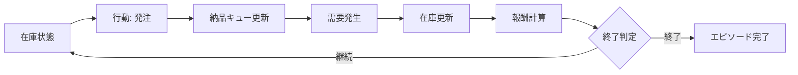
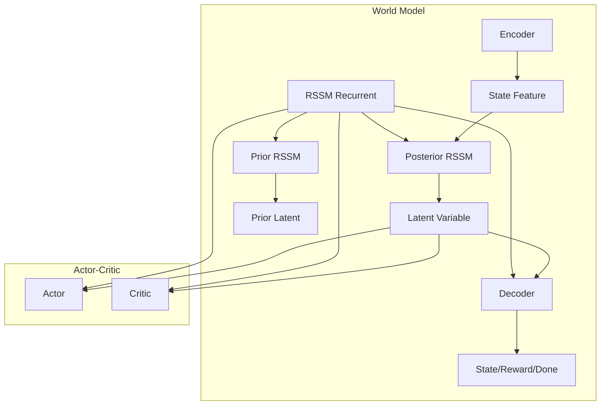
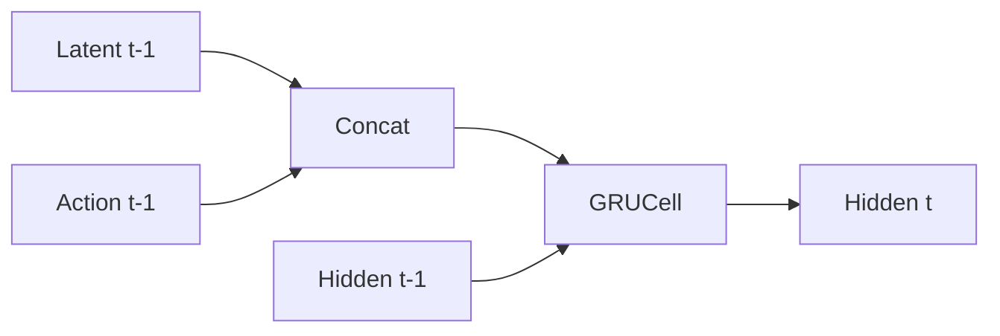
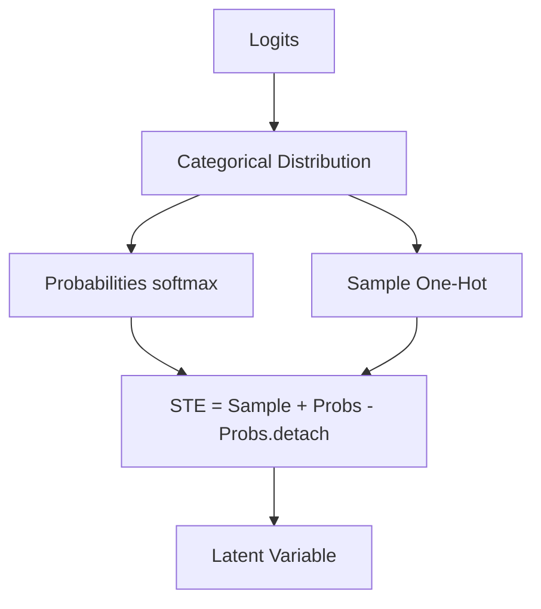
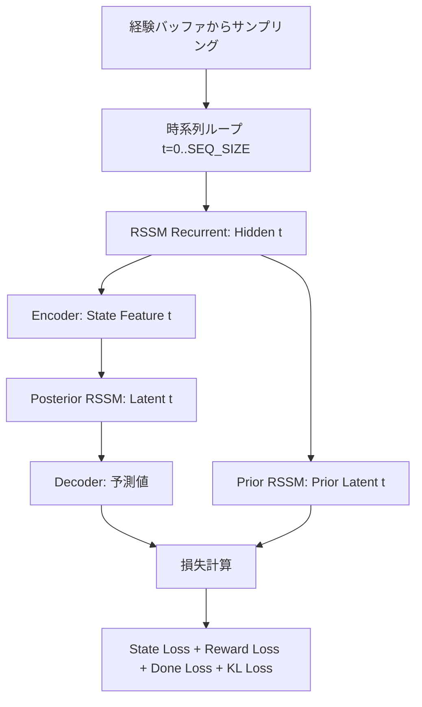
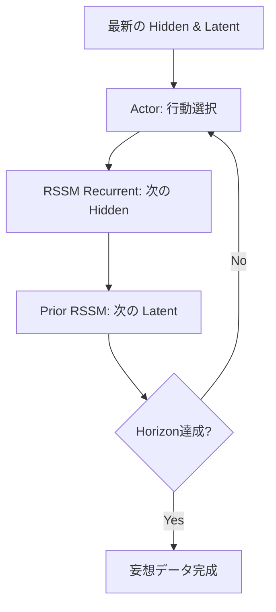
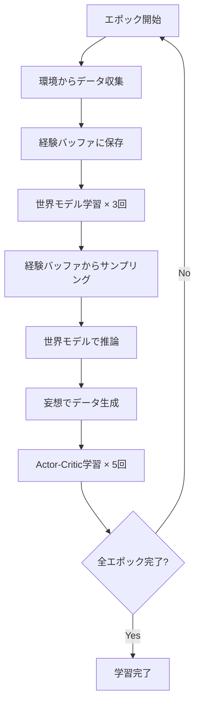
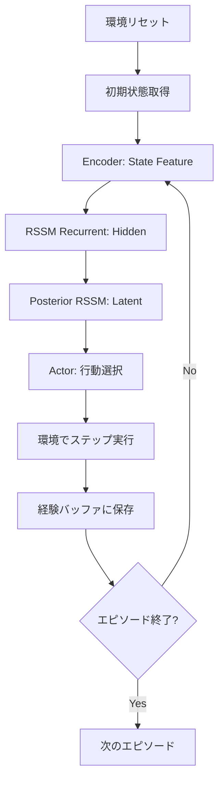

# このフォルダのプログラムについて

このフォルダのプログラムは、在庫に対しての最適量の発注を題材として、or-gymを用いて環境を組みつつ、TorchとTorchRLライブラリーを用いてDreamer v2を組んでみたものになります。<br>

# Dreamer V2による在庫管理システム

強化学習を用いた在庫最適化プログラムの解説

---

## プログラム概要

- **目的**: 在庫管理環境でDreamer V2アルゴリズムを実装
- **主要コンポーネント**:
  - カスタム在庫管理環境 (MyInventoryEnv)
  - 世界モデル (World Model)
  - Actor-Critic モデル
- **フレームワーク**: PyTorch, TorchRL, Gymnasium

---

## 在庫管理環境 (MyInventoryEnv)

### 環境の特徴
- **状態**: 在庫数 + 納品待ち数 (リードタイム分)
- **行動**: 発注量 (0〜10の離散値)
- **報酬設計**:
  - 在庫数15を基準に報酬を設定
  - 発注時にコスト発生 (-0.5)
  - 在庫切れ/過剰在庫でエピソード終了

### 需要モデル
- ポアソン分布 (期待値λ=3) からサンプリング

---

## 環境の状態遷移



---

## Dreamer V2 アーキテクチャ



---

## 世界モデル: Encoder

### 役割
状態から状態特徴量を抽出

### 構造
```python
Input: State (状態の次元数)
  ↓
Linear(256) + ReLU
  ↓
Linear(STATE_FEATURE_DIM)
  ↓
Output: State Feature
```

---

## 世界モデル: RSSM Recurrent

### 役割
前時刻の潜在変数・行動・隠れ状態から現時刻の隠れ状態を生成

### 構造
- **入力**: 潜在変数(t-1) + 行動(t-1) + 隠れ状態(t-1)
- **処理**: GRUCell (1層)
- **出力**: 隠れ状態(t)



---

## 世界モデル: RSSM Stochastic

### Posterior RSSM Stochastic
- **入力**: 状態特徴量(t) + 隠れ状態(t)
- **出力**: 事後潜在変数(t)

### Prior RSSM Stochastic
- **入力**: 隠れ状態(t)
- **出力**: 事前潜在変数(t)

### Straight-Through Estimator (STE)
- 順伝播: カテゴリカル分布からサンプリング (One-Hot)
- 逆伝播: 確率値を使用 (微分可能)

---

## STE (Straight-Through Estimator)

### 処理フロー


### 特徴
- 離散的な潜在変数を扱いながら勾配を伝播
- NUM_DISTS × NUM_CLASS の次元 (32 × 32 = 1024)

---

## 世界モデル: Decoder

### 役割
潜在変数と隠れ状態から環境の状態・報酬・完了フラグを予測

### 構造
```python
Input: Latent + Hidden
  ↓
├─ State Layers → 状態の再構成
├─ Reward Layers → 報酬の予測
└─ Done Layers + Sigmoid → 完了フラグの予測
```

---

## 世界モデルの学習フロー



---

## 世界モデルの損失関数

### 4つの損失項

1. **State Loss**: MSE(予測状態, 実状態)
2. **Reward Loss**: MSE(予測報酬, 実報酬)
3. **Done Loss**: BCE(予測完了フラグ, 実完了フラグ)
4. **KL Loss**: KL散逸度(事後分布 || 事前分布)

### KL Loss の特徴
- KL Balancing: 事後分布側を重視 (0.8)
- KL Threshold: 最小値を設定 (1.0)

---

## Actor モデル

### 役割
隠れ状態と潜在変数から行動を選択

### 構造
```python
Input: Hidden + Latent
  ↓
Linear(256) + ReLU
  ↓
Linear(256) + ReLU
  ↓
Linear(ACTION_DIM)
  ↓
Categorical Distribution
  ↓
Output: Action (離散値)
```

---

## Critic モデル

### 役割
隠れ状態と潜在変数から状態価値を推定

### 構造
```python
Input: Hidden + Latent
  ↓
Linear(256) + ReLU
  ↓
Linear(256) + ReLU
  ↓
Linear(1)
  ↓
Output: Value (状態価値)
```

---

## Imagination (妄想)

### 処理フロー


### 目的
- 世界モデル内で未来をシミュレーション
- Horizon分 (30ステップ) の軌跡を生成

---

## λ-Return の計算

### 再帰式
```
G_t = r_t + γ((1 - λ) * V_{t+1} + λ * G_{t+1})
```

- **G**: 収益 (Return)
- **r**: 報酬
- **γ**: 割引率 (0.99)
- **V**: 状態価値
- **λ**: TD法とモンテカルロ法の重み (0.95)

### 計算方向
ゴール地点から逆順に計算

---

## Actor-Critic の学習

### Actor の学習
1. 妄想データから報酬と状態価値を取得
2. λ-Return を計算
3. 損失: `-mean(λ-Return)`
4. Critic の勾配は一時的に無効化

### Critic の学習
1. 妄想データから状態価値を再計算
2. 損失: `MSE(状態価値, λ-Return)`

---

## 学習ループ全体



---

## ハイパーパラメータ

| パラメータ | 値 | 説明 |
|----------|-----|------|
| BATCH_SIZE | 8 | バッチサイズ |
| SEQ_SIZE | 30 | 時系列長 |
| HIDDEN_DIM | 400 | 隠れ状態の次元 |
| LATENT_DIM | 1024 | 潜在変数の次元 (32×32) |
| LEARNING_EPOCH | 150 | 学習エポック数 |
| HORIZON | 30 | 妄想の時間長 |

---

## データ収集フロー



---

## 推論フロー

### 学習済みモデルでの実行
1. 環境をリセット
2. 世界モデルで隠れ状態・潜在変数を更新
3. Actorで行動を選択
4. 環境でステップ実行
5. 結果を記録
6. エピソード終了まで繰り返し

### 評価指標
- 総報酬
- 在庫推移
- 発注行動

---

## 結果の可視化

### 損失値の推移
- 世界モデルの損失
- Actorの損失
- Criticの損失

### 推論結果
- 在庫数の推移
- 利用可能在庫 (在庫+納品待ち)
- 発注行動
- 在庫上限 (50)

---

## プログラムの主要な特徴

1. **モデルベース強化学習**: 環境の世界モデルを学習
2. **離散的潜在変数**: STEによる勾配伝播
3. **妄想による学習**: 実環境なしでActor-Criticを訓練
4. **TorchRL統合**: 経験バッファとTensorDictの活用
5. **カスタム環境**: Gymnasium準拠の在庫管理環境

---

## まとめ

- Dreamer V2アルゴリズムを在庫管理問題に適用
- 世界モデルで環境をモデル化
- 妄想内でActor-Criticを学習
- リードタイムを考慮した発注最適化
- 150エポックの学習で在庫管理ポリシーを獲得