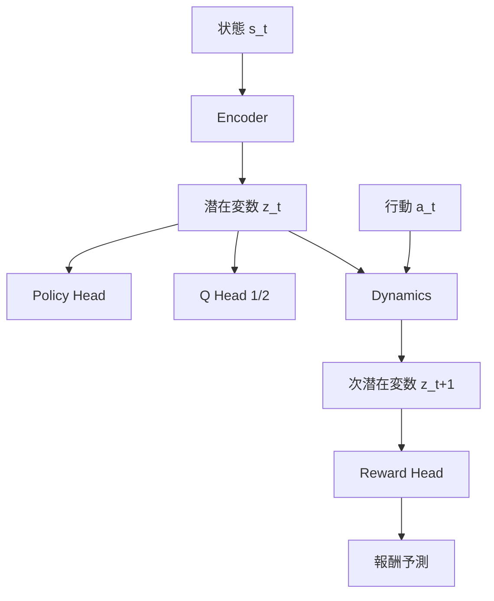
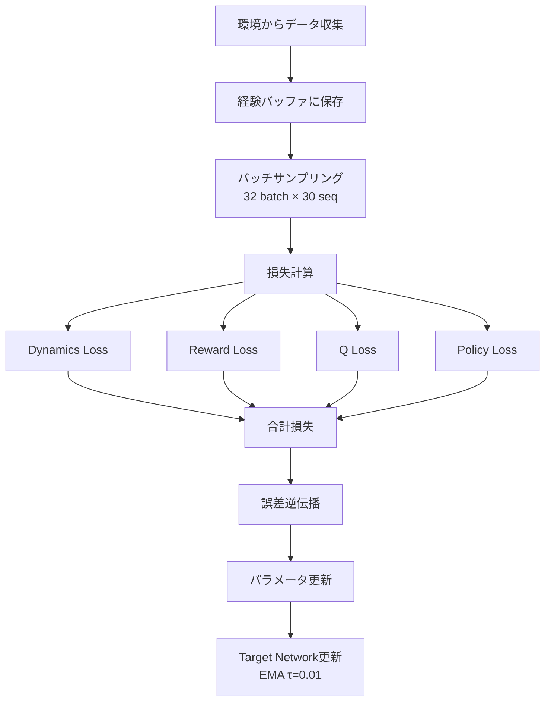
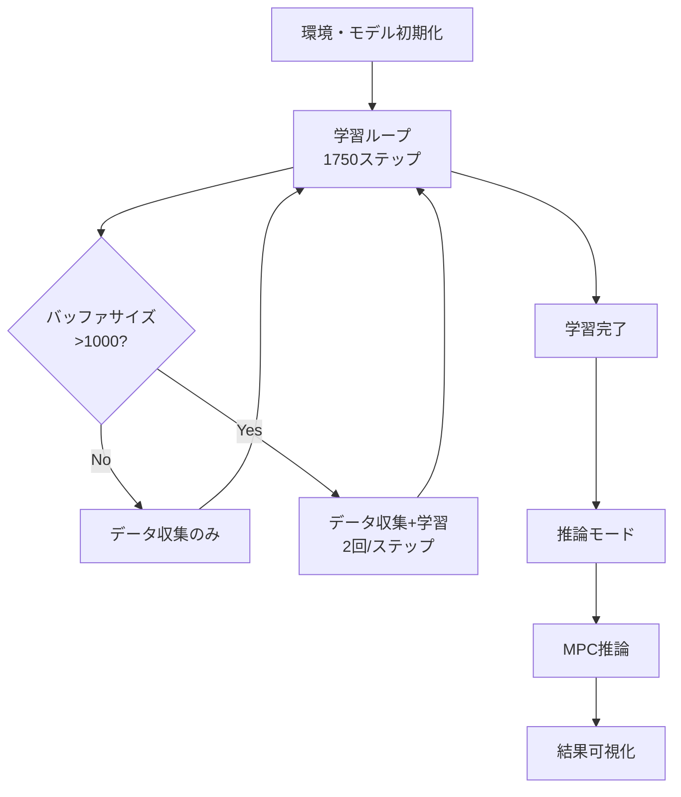

# このフォルダのプログラムについて

このフォルダのプログラムは、在庫に対しての最適量の発注を題材として、or-gymを用いて環境を組みつつ、TorchとTorchRLライブラリーを用いてTD-MPC2を組んでみたものになります。<br>

# TD-MPC2による在庫管理システム

強化学習を用いた在庫最適化プログラムの解説

---

## プログラム概要

- **目的**: 在庫管理環境でのTD-MPC2アルゴリズムの実装
- **使用技術**: 
  - PyTorch / TorchRL
  - Gymnasium (環境構築)
  - Model-Based強化学習

---

## カスタム環境: MyInventoryEnv

在庫管理をシミュレートする環境

### 主要パラメータ
- **初期在庫**: 20個
- **リードタイム**: 2日
- **需要**: ポアソン分布 (λ=3)
- **行動空間**: 0〜10個の発注量 (離散値)
- **状態空間**: [在庫数, 納品待ち数(2日分)]

---

## 環境の動作フロー


---

## 報酬設計

目標在庫数: **15個**

| 在庫との差分 (δ) | 報酬 |
|:---:|:---:|
| 0 < δ < 5 | +1.0 |
| 5 ≤ δ < 10 | 0 |
| δ ≥ 10 | -δ × 0.1 |

- **発注コスト**: 発注時に -0.5
- **終了条件**: 在庫が0または50に到達

---

## World Modelアーキテクチャ

TD-MPC2の中核となるニューラルネットワーク群



---

## モデルコンポーネント詳細

### 1. **Encoder**
- 状態 → 潜在変数 (256次元)

### 2. **Dynamics**
- 潜在変数 + 行動 → 次の潜在変数

### 3. **Reward Head**
- 次の潜在変数 → 報酬予測

### 4. **Q Head (2つ)**
- 潜在変数 + 行動 → 行動価値

### 5. **Policy Head**
- 潜在変数 → 行動 (Gumbel-Softmax)

---

## 学習プロセス



---

## 損失関数の構成

### 1. **Dynamics Loss**
```
MSE(Dynamics出力, Target Encoder出力)
```

### 2. **Reward Loss**
```
MSE(Reward Head出力, 実際の報酬)
```

### 3. **Q Loss** (Double Q-Learning)
```
MSE(Q出力, ベルマン方程式のターゲット)
ターゲット = r + γ × min(Q1_target, Q2_target)
```

### 4. **Policy Loss**
```
-mean(Q(s, π(s)))  # 行動価値の最大化
```

---

## 学習パラメータ

| パラメータ | 値 |
|:---|:---:|
| バッチサイズ | 32 |
| シーケンス長 | 30 |
| 学習ステップ数 | 1,750 |
| シード期間 | 800ステップ |
| 学習開始 | 1,000ステップ |
| 割引率 γ | 0.98 |
| EMA係数 τ | 0.01 |

---

## 損失の重み付け

```python
total_loss = (1.0 × dynamics_loss) 
           + (1.0 × reward_loss) 
           + (0.05 × q_loss) 
           + (0.05 × policy_loss)
```

- Dynamics/Rewardと比べてQ/Policyは値が大きくなりがちなので重みを下げて調整

---

## データ収集戦略

### フェーズ1: ランダム探索 (0〜800ステップ)
- 環境のaction_spaceからランダムサンプリング

### フェーズ2: モデルベース行動 (800ステップ以降)
- Encoder → 潜在変数
- Policy Head → 行動選択

### 経験バッファ
- 最大サイズ: 100,000
- ディスク保存 (LazyMemmapStorage)

---

## 推論: Model Predictive Control (MPC)


---

## MPC推論の詳細

### パラメータ
- **MPC回数**: 300
- **ホライゾン**: 30ステップ
- **行動選択**: ランダムシューティング

### n-step return計算
```
Return = Σ(γ^i × r_i) + γ^horizon × Q(s, a)
         i=0 to horizon-1
```

- 報酬予測 (Reward Head)
- 行動価値 (Q Head, min of Q1/Q2)

---

## Target Networkの更新

Exponential Moving Average (EMA) による安定化

```python
target_param = τ × param + (1 - τ) × target_param
```

### 対象ネットワーク
1. Target Encoder
2. Target Q Head 1
3. Target Q Head 2

### 更新タイミング
- 毎学習ステップ後

---

## Gumbel-Softmax Trick

離散行動での勾配逆伝播を可能にする技術

### 学習時
```python
action_onehot = gumbel_softmax(logits, τ=1.0, hard=True)
```
- One-Hotベクトルを微分可能な形で生成

### 推論時
- Categorical分布からサンプリング
- または完全ランダム (Random Shooting MPC)

---

## 評価指標の可視化

### 学習中
- Total Loss
- Dynamics Loss
- Reward Loss
- Q Loss
- Policy Loss

### 推論結果
- 在庫数の推移
- 発注行動の推移
- 利用可能在庫 (在庫+納品待ち)
- 合計報酬

---

## プログラムの実行フロー



---

## 主要な技術的特徴

1. **Model-Based RL**: 環境モデルを学習して計画
2. **Double Q-Learning**: 過大評価を防止
3. **Target Networks**: 学習の安定化
4. **MPC**: 複数ステップ先を見据えた行動選択
5. **Random Shooting**: 探索と活用のバランス

---

## まとめ

- **在庫管理問題**をカスタム環境として実装
- **TD-MPC2アルゴリズム**による世界モデル学習
- **4つの損失関数**を同時最適化
- **MPC**による推論時の行動選択
- リードタイムと需要の不確実性を考慮した最適化